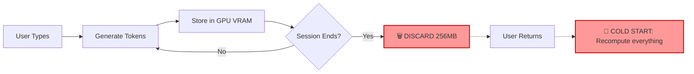
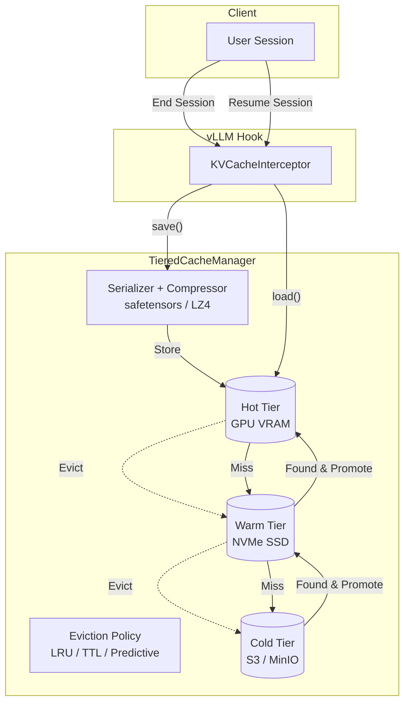

<div align="center">
  <h1>🔄 KV Cache Tier Persistence</h1>
  <p><b>A Tiered Storage System for LLM Inference KV Caches</b></p>

  
  
  

  *Every time a ChatGPT session ends, gigabytes of GPU compute are thrown in the trash. This project catches them and stores them for later.*
</div>

---

## 🛑 The Problem

Modern LLM inference relies heavily on the **KV Cache** (Key-Value Attention Cache) to avoid recomputing previous tokens in a sequence. This cache lives in GPU VRAM, which is extremely fast but heavily constrained.

Consider a LLaMA-7B model:
- A single 512-token conversation produces **~256MB** of KV cache.
- When the user closes the tab, this 256MB is **discarded**.
- If the user returns 10 minutes later, the system experiences a **Cold Start**, recomputing all 256MB from scratch.
- At scale (e.g., 500 concurrent users), you are wasting **128GB of VRAM capacity** continuously.

<div align="center">


</div>

## 💡 The Solution

This project introduces a **Three-Tier Storage Hierarchy** for KV caches, modeled after enterprise storage systems. Instead of discarding the cache on session end, it is migrated to cheaper storage and reloaded on demand.

```text
┌─────────────────────────────────┐
│  HOT TIER  — GPU VRAM           │  ← Active conversations right now
│  ~80GB, ~microsecond latency    │    (Simulated in memory)
├─────────────────────────────────┤
│  WARM TIER — NVMe SSD / CPU RAM │  ← Recent sessions, may resume soon
│  ~1–4TB, ~millisecond latency   │    (Filesystem-backed)
├─────────────────────────────────┤
│  COLD TIER — Object Storage     │  ← Archived sessions, long-term
│  Unlimited, ~100ms latency      │    (MinIO/S3 or compressed local)
└─────────────────────────────────┘
```

When a user returns, the system checks Hot → Warm → Cold tiers. If found, the session resumes instantly without recomputing the context.

## 🏗️ Architecture



### What gets saved?
We intercept the exact tensor structures used by vLLM. For a standard model, this looks like:
```python
kv_cache = {
    layer_0: (key_tensor, value_tensor),  # shape: [32, 512, 128] each
    layer_1: (key_tensor, value_tensor),
    # ... up to layer 31
}
```

### Serialization Options
| Format | Compression | Best For | Speed | Size |
|--------|-------------|----------|-------|------|
| `safetensors` | LZ4 | Hot ↔ Warm | ⚡⚡⚡ | Medium |
| `raw_binary` | None | GPU ↔ RAM | ⚡⚡⚡⚡ | Large |
| `safetensors` | Zstd | Warm ↔ Cold | ⚡ | Small |

## 🧠 Eviction Policies

This project implements three distinct eviction policies:

1. **LRU (Least Recently Used)**: The industry standard. Simple, effective, but vulnerable to "scan pollution" if a burst of one-off users flushes valuable caches.
2. **TTL (Time-to-Live)**: Time-based expiry. Excellent for compliance (e.g., "delete all data after 24h").
3. **Predictive (Novel Contribution)**: Uses an access-pattern heuristic to predict *which* sessions will resume.
   - Calculates a score based on: `α * Frequency + β * Recency + γ * Session_Length`
   - Keeps long, frequently accessed sessions in the Warm tier longer than short, one-off interactions.

## 🚀 Quick Start

### Installation
```bash
git clone https://github.com/yourusername/kv-cache-tier-persistence.git
cd kv-cache-tier-persistence
pip install -e ".[dev]"
```

### Usage Example
```python
import numpy as np
from kv_cache_tier.config import SystemConfig
from kv_cache_tier.core.tiered_manager import TieredCacheManager
from kv_cache_tier.utils.tensor_utils import generate_random_kv_cache

# 1. Initialize configuration
config = SystemConfig.default()

# 2. Start the manager
manager = TieredCacheManager(config)

# 3. Simulate a session ending
session_id = "user123_chat_1"
dummy_kv_data = generate_random_kv_cache(config.model, token_count=512)

# Save cache (goes to Hot tier, evicts older to Warm/Cold if full)
manager.save(session_id, user_id="user123", kv_data=dummy_kv_data)

# 4. User returns 20 minutes later!
loaded_data = manager.load(session_id)
if loaded_data:
    print("✅ Cache Hit! Resumed instantly without GPU recompute.")
```

## 🧪 Unit Tests

The project includes a comprehensive test suite covering serialization, eviction logic, tier migrations, and edge cases. To run the unit tests:

```bash
# Run all tests using pytest
pytest tests/ -v

# Run with coverage report (if using make)
make test-cov
```

## 📊 Benchmarks

The project includes a comprehensive benchmark suite that simulates realistic user arrival patterns (Poisson distributions) and session lengths (log-normal distributions).

Run the suite (cross-platform Python commands):
```bash
# Run a quick check (uses small model config, completes in seconds)
python -m benchmarks.run_benchmarks --suite quick

# Run the full rigorous suite (simulates 50 users and massive models)
python -m benchmarks.run_benchmarks --suite all
```

*Note: If you are on Linux/macOS with `make` installed, you can also use `make bench-quick` and `make bench-full`.*

The suite generates:
- **Latency Benchmarks**: How fast can we push 256MB through the tiers?
- **Throughput Benchmarks**: How many concurrent saves/loads can we handle?
- **Hit Rate Benchmarks**: Which eviction policy actually prevents the most cold starts?

*(Charts are saved to `benchmarks/results/`)*

## 🧩 vLLM Integration Path

This project serves as a standalone research prototype. To integrate it directly into vLLM, look at the `KVCacheInterceptor` class in `src/kv_cache_tier/interceptor/kv_cache_interceptor.py`.

It maps directly to vLLM's `CacheEngine.swap_out` and the newer `KVTransferConfig` connector API.

## 📁 Project Structure

```
kv-cache-tier-persistence/
├── src/kv_cache_tier/
│   ├── core/           # Main orchestrator, cache blocks, session tracking
│   ├── eviction/       # LRU, TTL, Predictive policies
│   ├── serialization/  # safetensors, raw binary, LZ4, Zstd
│   ├── tiers/          # Hot, Warm, Cold tier implementations
│   ├── interceptor/    # vLLM integration hook designs
│   └── utils/          # Metrics, logging, tensor utilities
├── benchmarks/         # Workload generator and benchmark suites
├── tests/              # Pytest suite
└── docs/               # Deep architectural documentation
```

## 🔬 Research Context

This project draws inspiration from recent MLSys/ATC papers:
- **LMCache / vLLM Offloading**: Moving from GPU to CPU/Disk.
- **FlexGen**: Disk-based offloading for large batch throughput.
- **CacheBlend / RadixAttention**: KV cache reuse and patching.

**Primary Research Question**: *Can a predictive eviction policy applied to a three-tier storage hierarchy significantly out-perform LRU in minimizing LLM cold-start latency at scale?*

---
*MIT License. See LICENSE file for details.*
