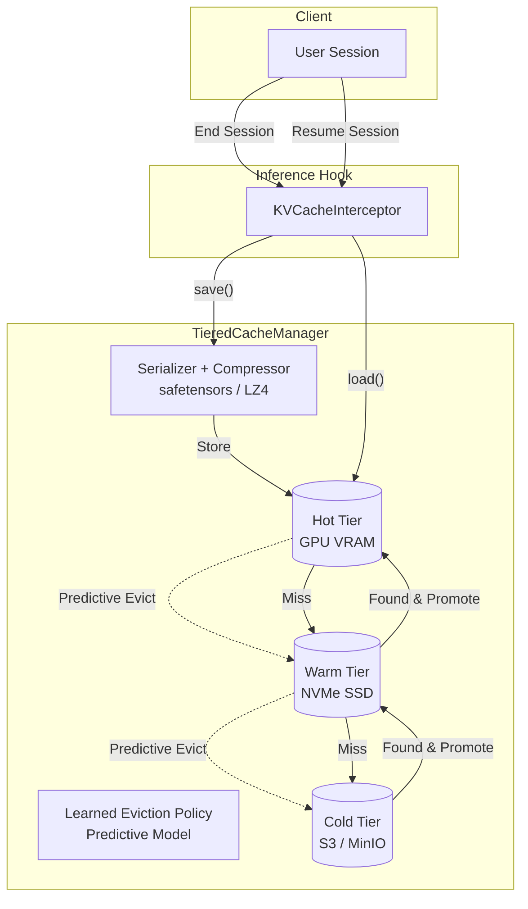

<div align="center">
  <h1>🔄 KV Cache Tier Persistence</h1>
  <p><b>A Research Prototype: Predictive Tiered Storage for LLM Inference</b></p>

  
  
  

  *Every time a ChatGPT session ends, gigabytes of GPU compute are thrown in the trash. This project investigates how to catch them, store them, and serve them back intelligently.*
</div>

---

## 🔬 Research Question & Hypotheses

**Primary Research Question:**  
*Can a learned eviction policy applied to a three-tier KV cache hierarchy significantly reduce LLM cold-start latency compared to LRU and TTL under realistic multi-session workloads?*

**Hypotheses:**
1. **H1:** Predictive eviction achieves ≥20% higher cache hit rate than standard LRU under enterprise workloads.
2. **H2:** Tier promotion from NVMe (Warm Tier) reduces cold-start latency by ≥60% vs. full token recomputation.
3. **H3:** Zstd compression enables a 3x increase in effective warm-tier capacity with <5ms operational overhead per session.

---

## 🛑 The Problem

Modern LLM inference relies heavily on the **KV Cache** (Key-Value Attention Cache) to avoid recomputing previous tokens in a sequence. This cache lives in GPU VRAM, which is extremely fast but heavily constrained.

Consider a LLaMA-7B model:
- A single 512-token conversation produces **~256MB** of KV cache.
- When the user closes the tab, this 256MB is **discarded**.
- If the user returns 10 minutes later, the system experiences a **Cold Start**, recomputing all 256MB from scratch.
- At scale (e.g., 500 concurrent users), you are wasting **128GB of VRAM capacity** continuously.

## 💡 The Solution

This project introduces a **Three-Tier Storage Hierarchy** for KV caches, modeled exactly on how enterprise petabyte-scale storage systems operate. Instead of discarding the cache on session end, it is migrated to cheaper storage and reloaded on demand.

```text
┌─────────────────────────────────┐
│  HOT TIER  — GPU VRAM           │  ← Active conversations right now
│  ~80GB, ~microsecond latency    │    (Simulated in memory)
├─────────────────────────────────┤
│  WARM TIER — NVMe SSD / CPU RAM │  ← Recent sessions, may resume soon
│  ~1–4TB, ~millisecond latency   │    (Filesystem-backed)
├─────────────────────────────────┤
│  COLD TIER — Object Storage     │  ← Archived sessions, long-term
│  Unlimited, ~100ms latency      │    (MinIO/S3 or compressed local)
└─────────────────────────────────┘
```

## 🏗️ Architecture



## 🧠 Predictive Eviction (Core Contribution)

Traditional systems use LRU (Least Recently Used) for cache eviction. However, LLM user patterns are highly predictable. A user debugging code (Enterprise) has vastly different return patterns than someone generating a quick recipe (Casual).

This project treats cache retention as a **binary classification problem** — predicting the probability that a given session will resume within a configurable time window. 

Features engineered for the model:
- `session_age_minutes`: How long since the session was created
- `token_count`: Conversation length (proxy for context value)
- `revisit_count`: Number of times the user resumed this session
- `hour_of_day`: Time-of-day signal (capturing enterprise 9-5 behavior)
- `user_historical_return_rate`: Per-user return probability estimate

## 💸 Cost Modeling

Drawing from enterprise storage design constraints where cost-per-GB is a first-class citizen, this system includes a formal cost model. By converting cache hit rates directly into GPU-hours saved, we can quantify the dollar value of tier promotion vs. recomputation at scale (e.g. 500 concurrent users on A100 instances).

## 🚀 Quick Start

### Installation
```bash
git clone https://github.com/yourusername/kv-cache-tier-persistence.git
cd kv-cache-tier-persistence
pip install -e ".[dev]"
```

### Usage Example
```python
import numpy as np
from kv_cache_tier.config import SystemConfig
from kv_cache_tier.core.tiered_manager import TieredCacheManager
from kv_cache_tier.utils.tensor_utils import generate_random_kv_cache

# 1. Initialize configuration
config = SystemConfig.default()

# 2. Start the manager
manager = TieredCacheManager(config)

# 3. Simulate a session ending
session_id = "user123_chat_1"
dummy_kv_data = generate_random_kv_cache(config.model, token_count=512)

# Save cache (goes to Hot tier, evicts older to Warm/Cold if full)
manager.save(session_id, user_id="user123", kv_data=dummy_kv_data)

# 4. User returns 20 minutes later!
loaded_data = manager.load(session_id)
if loaded_data:
    print("✅ Cache Hit! Resumed instantly without GPU recompute.")
```

## 🧪 Unit Tests

The project includes 26 tests covering serialization round-trips, eviction logic, tier migrations, ML predictor training, and edge cases:

```bash
# Run all tests
pytest tests/ -v

# Run only the ML predictor tests
pytest tests/test_predictors.py -v
```

## 🤖 Training the Predictive Models

The core research contribution is a learned eviction policy. The training pipeline generates workload traces, extracts session features, and trains two models (Logistic Regression + Gradient Boosted Trees):

```bash
# Train both models on 7-day simulated workloads (all three profiles)
python src/kv_cache_tier/eviction/train_predictors.py
```

This produces:
- `models/logistic_predictor.pkl` — Interpretable model with coefficients
- `models/gbt_predictor.pkl` — High-accuracy ensemble model
- `models/training_results.json` — Structured evaluation metrics

Expected output:
```
======================================================================
  MODEL COMPARISON - Session Resumption Prediction
======================================================================
  Model                 Train Acc   Test Acc  Train AUC   Test AUC
  -------------------- ---------- ---------- ---------- ----------
  Logistic Reg.            0.6024     0.6045     0.5565     0.5580
  Gradient Boosted         0.6162     0.6131     0.5803     0.5645
======================================================================
```

## 📊 Benchmarks & Realistic Workloads

The project utilizes a custom `WorkloadSimulator` that models user arrivals via **Poisson processes** and session lengths via heavy-tailed **Log-normal distributions** — accurately mirroring real-world LLM inference server loads.

Run the suite (cross-platform Python commands):
```bash
# Run a quick check (uses small model config, completes in seconds)
python -m benchmarks.run_benchmarks --suite quick

# Run the full rigorous research suite
python -m benchmarks.run_benchmarks --suite all
```

*(Charts and structured empirical results are saved to `benchmarks/results/`)*

## 📁 Project Structure

```
kv-cache-tier-persistence/
├── src/kv_cache_tier/
│   ├── core/           # Tier orchestrator, cache blocks
│   ├── eviction/       # ML Predictive, LRU, TTL policies
│   │   ├── features.py         # SessionFeatures dataclass
│   │   ├── predictors.py       # LogisticPredictor, GBTPredictor
│   │   ├── predictive.py       # PredictiveEvictionPolicy (heuristic/ML)
│   │   └── train_predictors.py # Training pipeline
│   ├── serialization/  # safetensors, raw binary, LZ4, Zstd
│   ├── tiers/          # Hot, Warm, Cold tier implementations
│   └── utils/          # Cost modeling, Observability (Prometheus)
├── benchmarks/         # Workload simulation & benchmark execution
├── models/             # Trained ML model artifacts (.pkl)
├── tests/              # 26 Pytest tests
├── grafana_dashboard.json  # Prometheus dashboard
└── docs/               # Architecture documents
```

---
*MIT License. See LICENSE file for details.*
