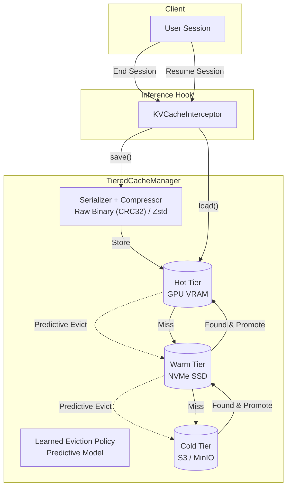

<div align="center">
  <h1>KV Cache Tier Persistence</h1>
  <p><b>Learned and value-aware eviction for tiered LLM KV-cache storage</b></p>

  [](https://github.com/aditya-lawankar/kv-cache-tier-persistence/actions/workflows/ci.yml)
  
  

  *When an LLM chat session ends, its KV cache is usually discarded, and a returning user pays
  the full prefill cost again. This project persists KV caches across GPU memory, local storage
  and object storage, and measures which eviction policy saves the most GPU compute.*
</div>

---

## Research question and findings

**Primary Research Question:**  
*Can a learned eviction policy applied to a three-tier KV cache hierarchy significantly reduce LLM cold-start cost compared to LRU and TTL under realistic multi-session workloads?*

We began with the hypothesis that predictive eviction would beat LRU on **hit rate**. The data
falsified that hypothesis, and the diagnosis of *why* became the project's actual contribution:

1. **LRU wins hit rate, and loses on value.** Across every constrained workload LRU has the
   highest hit rate. Measured in GPU compute actually saved, it delivers the *least* value of
   any policy tested on enterprise traffic. Ranking by hit rate selects the lowest-value policy.
2. **Hit rate assumes all hits are worth the same, and KV caching violates that twice.** A hit
   is worth nothing unless the prefill it avoids exceeds the restore it costs (the break-even
   length *N\**), and above that threshold savings grow superlinearly with context length.
3. **The served architecture decides whether the metric is safe.** On a large GQA model where
   *N\** is 12 tokens, nearly every hit pays and hit rate is an adequate proxy. When the
   workload straddles *N\**, it is actively misleading.

**Headline results** (500MB tiered cache, 6h simulated, 10 seeds, paired 95% CIs vs LRU on
identical traces, priced at TinyLlama-1.1B economics). Value is GPU-seconds saved per day:

| Policy | Enterprise hit% | GPU-s/day | ×LRU | Power-user hit% | ×LRU |
|---|---|---|---|---|---|
| LRU | **79.1** | 36.8 | 1.00 | **96.0** | 1.00 |
| Heuristic | 55.3 | 60.7 | 1.65 | 84.2 | 1.08 |
| Logistic V1 | 67.9 | 63.5 | 1.73 | 83.9 | 0.96 |
| Value Density V2 | 58.2 | **73.2** | **1.99** | 76.9 | 0.96 |
| Space-Time V3 | 57.8 | 72.4 | 1.97 | 79.6 | 1.05 |

All enterprise deltas are significant. Power-user sessions sit far above *N\**, so nearly every
hit is valuable there and the two metrics reconverge, which is exactly what the mechanism predicts.

**Real-trace replication** (Azure LLM inference trace, one week of production arrivals, ten
6-hour windows as paired replicates): both halves replicate and the inversion strengthens. LRU
again wins hit rate (83.9%) and again delivers the least value (32.1 GPU-s/day); Value Density V2
saves 2.18× as much (70.0), Logistic V1 1.84×, all significant, with the learned policies running
zero-shot on traffic they never trained on. Replays real arrival timestamps and request sizes;
session return behavior is modeled, since the public trace has no conversation identifiers (see
`benchmarks/azure_trace_loader.py` for the permutation-control evidence). Regenerate via
`make reproduce-azure` (downloads ~1.1 GB on first use).

**Robustness.** A ground-truth oracle ablation shows two clairvoyant policies with *identical*
100.0% hit rates still differ significantly in delivered value, because tier placement decides
what a hit is worth. A persona-strength sweep varies how predictable the simulated world is
(AUC 0.659 to 0.739, retraining at each setting): the learned policy's standing depends on that
choice, the metric finding does not.

**Provisioning dominates policy.** A two-tier control (cold tier removed, its capacity given
to hot and warm, total bytes held fixed) raises LRU from 36.8 to 131.0 GPU-s/day, a 3.6×
gain from deleting a tier whose restore can never be repaid at this architecture's break-even
length. That is larger than any eviction policy we evaluated (best: 1.99×). The metric
inversion survives the correction at 1.15×, so it is not merely an artifact of the
provisioning error. Regenerate with `--tiers two`.

**Hardware validation.** A long-context sweep on Llama-3.2-1B (T4, 512 to 6,144 tokens) shows
cold prefill growing 14.8× while the restore path grows 1.8× over the same 12× context increase,
reaching a 9.1× TTFT speedup. Restoration is faithful: the warm and cold next-token logit vectors
differ by at most 0.031, FP16 rounding on a scale spanning tens. Results in
`benchmarks/results/gpu_sweep/`; regenerate with `benchmarks/context_sweep_gpu.ipynb`.

All numbers regenerate via `make reproduce` and `make reproduce-arch` — see
`benchmarks/experiment_runner.py`,
`benchmarks/results/experiment_results_v3_aggregate.json`, and
`benchmarks/results/experiment_results_azure_aggregate.json`.

---

## Papers

**Full paper — [Hit Rate Is Not Value: A Rigorous Evaluation of Learned and Value-Aware
Eviction for Tiered LLM KV-Cache Persistence](paper.pdf)** — USENIX-style, covering the
system design, the V1→V2→V3 eviction-policy progression, the statistical methodology, the
break-even analysis across model architectures, the oracle and persona ablations, and
the TinyLlama end-to-end validation. LaTeX sources in
[`paper/latex/`](paper/latex/); every number and figure regenerates from the committed
result JSONs (`make reproduce`).

**Workshop paper — [Hit Rate Is Not Value: When Cache Metrics Mislead in Tiered LLM
KV-Cache Persistence](paper/workshop/paper.pdf)** — a 4-page condensation for the NeurIPS
2026 Machine Learning for Systems workshop, in NeurIPS format. It keeps the metric
reversal, the break-even mechanism with both decomposition controls, the provisioning
result, the oracle ablation, and the harness-bug asymmetry; it drops the system design,
the compression and latency benchmarks, and the end-to-end validation detail. Sources and
build instructions in [`paper/workshop/`](paper/workshop/).

These are **separate deliverables** built from separate sources. `make arxiv` packages the
full paper only; `make workshop-bundle` packages the workshop paper only. Both draw their
numbers from the same committed result JSONs, and each has its own audit script.

---

## Background

### The problem

Modern LLM inference relies heavily on the **KV Cache** (Key-Value Attention Cache) to avoid recomputing previous tokens in a sequence. This cache lives in GPU VRAM, which is extremely fast but heavily constrained.

Consider a LLaMA-7B model:
- A single 512-token conversation produces **~256MB** of KV cache.
- When the user closes the tab, this 256MB is **discarded**.
- If the user returns 10 minutes later, the system experiences a **Cold Start**, recomputing all 256MB from scratch.
- At scale (e.g., 500 concurrent users), you are wasting **128GB of VRAM capacity** continuously.

### Approach

This project introduces a **Three-Tier Storage Hierarchy** for KV caches, modeled on the hot/warm/cold tiering used in large storage systems. Instead of discarding the cache on session end, it is migrated to cheaper storage and reloaded on demand.

```text
┌─────────────────────────────────┐
│  HOT TIER  — GPU VRAM           │  ← Active conversations right now
│  ~80GB, ~microsecond latency    │    (Simulated in memory)
├─────────────────────────────────┤
│  WARM TIER — NVMe SSD / CPU RAM │  ← Recent sessions, may resume soon
│  ~1–4TB, ~millisecond latency   │    (Filesystem-backed)
├─────────────────────────────────┤
│  COLD TIER — Object Storage     │  ← Archived sessions, long-term
│  Unlimited, ~100ms latency      │    (MinIO/S3 or compressed local)
└─────────────────────────────────┘
```

### Architecture


```mermaid
flowchart TD
    subgraph Client
        U["User Session"]
    end

    subgraph "Inference Hook"
        I["KVCacheInterceptor"]
    end

    subgraph TieredCacheManager
        E["Learned Eviction Policy<br/>Predictive Model"]
        S["Serializer + Compressor<br/>Raw Binary (CRC32) / Zstd"]

        H[("Hot Tier<br/>GPU VRAM")]
        W[("Warm Tier<br/>NVMe SSD")]
        C[("Cold Tier<br/>S3 / MinIO")]
    end

    U -->|"End Session"| I
    I -->|"save()"| S
    S -->|"Store"| H

    H -.->|"Predictive Evict"| W
    W -.->|"Predictive Evict"| C

    U -->|"Resume Session"| I
    I -->|"load()"| H
    H -->|"Miss"| W
    W -->|"Miss"| C
    C -->|"Found & Promote"| W
    W -->|"Found & Promote"| H
```

### Eviction policies (V1 → V2 → V3)

Traditional systems use LRU (Least Recently Used) for cache eviction. However, LLM user patterns are highly predictable. A user debugging code (Enterprise) has vastly different return patterns than someone generating a quick recipe (Casual).

The project evaluates a progression of eviction policies:

- **V1 (Logistic/GBT):** treats retention as **binary classification** — predict
  P(resume) within a time window, evict the least likely. *Fails under capacity
  pressure*: classification ignores entry size (the Knapsack mismatch).
- **V2 (Value Density):** maximizes expected GPU savings per cached byte,
  P(resume) × RecomputeCost(N) / Size(N), with an optional admission-control gate.
  *Delivers the most value on enterprise traffic* under architecture-correct pricing,
  trading cardinality for value deliberately.
- **V3 (Space-Time Density):** divides value density by expected sojourn
  time E[Δt] (estimated from an EMA of observed inter-access gaps), charging
  each entry for the space-time volume it occupies, an LHD-style objective
  adapted to quadratic recompute costs. Beats V2 significantly only under high
  size variance, where hoarding is a real risk. Implemented in
  `src/kv_cache_tier/eviction/space_time.py`.

Features engineered for the P(resume) models:
- `session_age_minutes`: How long since the session was created
- `token_count`: Conversation length (proxy for context value)
- `revisit_count`: Number of times the user resumed this session
- `hour_of_day`: Time-of-day signal (capturing enterprise 9-5 behavior)
- `user_historical_return_rate`: Per-user return probability estimate

### Workloads and cost model

Synthetic workloads come from a custom `WorkloadSimulator` that models user arrivals as **Poisson processes** and session lengths with heavy-tailed **log-normal distributions**, and gives each simulated user a persistent persona (return propensity, verbosity, active hours).

Drawing from enterprise storage design constraints where cost-per-GB is a first-class citizen, this system includes a formal cost model. By converting cache hit rates directly into GPU-hours saved, we can quantify the dollar value of tier promotion vs. recomputation at scale (e.g. 500 concurrent users on A100 instances).

## Quick start

### Installation
```bash
git clone https://github.com/aditya-lawankar/kv-cache-tier-persistence.git
cd kv-cache-tier-persistence
pip install -e ".[dev]"
```

### Usage Example
```python
import numpy as np
from kv_cache_tier.config import SystemConfig
from kv_cache_tier.core.tiered_manager import TieredCacheManager
from kv_cache_tier.utils.tensor_utils import generate_random_kv_cache

# 1. Initialize configuration
config = SystemConfig.default()

# 2. Start the manager
manager = TieredCacheManager(config)

# 3. Simulate a session ending
session_id = "user123_chat_1"
dummy_kv_data = generate_random_kv_cache(config.model, token_count=512)

# Save cache (goes to Hot tier, evicts older to Warm/Cold if full)
manager.save(session_id, user_id="user123", kv_data=dummy_kv_data)

# 4. User returns 20 minutes later!
loaded_data = manager.load(session_id)
if loaded_data:
    print("Cache hit: resumed without recomputing the prefill.")
```

## Tests

The project includes 69 tests covering serialization round-trips (including CRC32 corruption detection), eviction logic, tier migrations, ML predictor training, the simulated clock, workload realism properties (monotonic session growth, persona differentiation, reproducibility), and the Azure real-trace loader:

```bash
# Run all tests
pytest tests/ -v

# Run only the ML predictor tests
pytest tests/test_predictors.py -v
```

## Reproducing the results

Every number and figure in the papers regenerates from committed result JSONs:

```bash
make reproduce          # synthetic experiment matrix: 6 policies x 3 workloads x 10 seeds
make reproduce-arch     # the matrix re-priced for TinyLlama-1.1B and a Llama-70B-class GQA model
make reproduce-azure    # real-trace evaluation on the Azure LLM inference trace (~1.1 GB download)
make audit              # re-derive every figure quoted in the papers and fail on any mismatch
```

[`docs/REPRODUCING.md`](docs/REPRODUCING.md) covers the rest: training the predictors, the
oracle ablation, capacity and persona sweeps, the compression benchmark, TinyLlama and GPU
validation, the break-even analysis and building the papers.

## Project structure

```
kv-cache-tier-persistence/
├── src/kv_cache_tier/
│   ├── core/           # Tier orchestrator, cache blocks
│   ├── eviction/       # Eviction policies
│   │   ├── lru.py / ttl.py     # Baselines
│   │   ├── predictive.py       # V1: heuristic + learned P(resume)
│   │   ├── value_density.py    # V2: value per byte (+ admission control)
│   │   ├── space_time.py       # V3: value per byte-second (LHD-style)
│   │   ├── features.py         # SessionFeatures + shared FeatureExtractor
│   │   ├── predictors.py       # LogisticPredictor, GBTPredictor
│   │   └── train_predictors.py # Training pipeline
│   ├── serialization/  # Raw binary (CRC32), safetensors, LZ4, Zstd
│   ├── tiers/          # Hot, Warm, Cold tier implementations
│   └── utils/          # Clock (simulated time), cost model, metrics
├── benchmarks/         # Simulator, experiment runner, Azure loader,
│                       # break-even analysis, TinyLlama + GPU validation
├── models/             # Trained ML model artifacts (.pkl)
├── tests/              # 69 Pytest tests
├── paper/
│   ├── latex/           # Full paper sources + figures (paper.pdf at repo root)
│   ├── workshop/        # 4-page NeurIPS workshop paper (separate deliverable)
│   └── mlsys27/         # MLSys-format version of the full paper
└── docs/               # Architecture documents
```

---
*MIT License. See LICENSE file for details.*

## Errata

Earlier versions of this README reported that LRU won *both*
metrics and that static value-density eviction "collapsed." Both claims came from a cost model
that contained no model architecture: it priced prefill with two hardcoded constants whose
linear/quadratic crossover sat an order of magnitude away from any real transformer, inflating
a long session's worth relative to a short one by 3–4.5×. It has been replaced with the same
physics the break-even analysis uses (`src/kv_cache_tier/utils/hardware.py`), validated to within
2× of measured GPU prefill latency. The paper documents both this and an earlier, opposite-signed
harness bug.

## Citing

If you use this code or its results, please cite it using the metadata in
[`CITATION.cff`](CITATION.cff) (GitHub's "Cite this repository" button).

## License

MIT. See [LICENSE](LICENSE).
