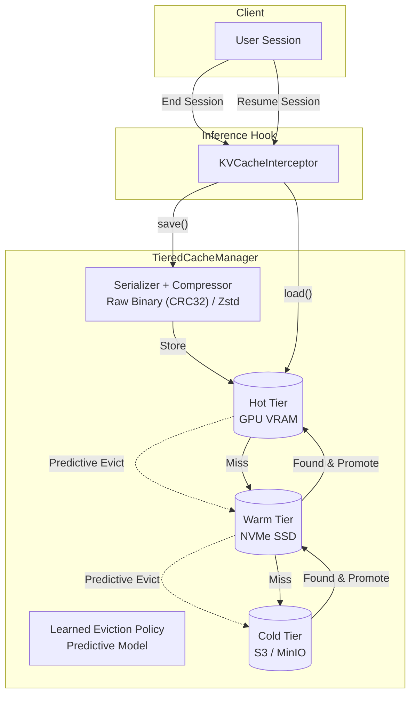

<div align="center">
  <h1>🔄 KV Cache Tier Persistence</h1>
  <p><b>A Research Prototype: Predictive Tiered Storage for LLM Inference</b></p>

  
  
  

  *Every time a ChatGPT session ends, gigabytes of GPU compute are thrown in the trash. This project investigates how to catch them, store them, and serve them back intelligently.*
</div>

---

## 🔬 Research Question & Findings

**Primary Research Question:**  
*Can a learned eviction policy applied to a three-tier KV cache hierarchy significantly reduce LLM cold-start cost compared to LRU and TTL under realistic multi-session workloads?*

We began with the hypothesis that predictive eviction would beat LRU on **hit rate**. The data
falsified that hypothesis, and the diagnosis of *why* became the project's actual contribution:

1. **LRU wins hit rate, and loses on value.** Across every constrained workload LRU has the
   highest hit rate. Measured in GPU compute actually saved, it delivers the *least* value of
   any policy tested on enterprise traffic. Ranking by hit rate selects the lowest-value policy.
2. **Hit rate assumes all hits are worth the same, and KV caching violates that twice.** A hit
   is worth nothing unless the prefill it avoids exceeds the restore it costs (the break-even
   length *N\**), and above that threshold savings grow superlinearly with context length.
3. **The served architecture decides whether the metric is safe.** On a large GQA model where
   *N\** is 12 tokens, nearly every hit pays and hit rate is an adequate proxy. When the
   workload straddles *N\**, it is actively misleading.

**Headline results** (500MB tiered cache, 6h simulated, 10 seeds, paired 95% CIs vs LRU on
identical traces, priced at TinyLlama-1.1B economics). Value is GPU-seconds saved per day:

| Policy | Enterprise hit% | GPU-s/day | ×LRU | Power-user hit% | ×LRU |
|---|---|---|---|---|---|
| LRU | **79.1** | 36.8 | 1.00 | **96.0** | 1.00 |
| Heuristic | 55.3 | 60.7 | 1.65 | 84.2 | 1.08 |
| Logistic V1 | 67.9 | 63.5 | 1.73 | 83.9 | 0.96 |
| Value Density V2 | 58.2 | **73.2** | **1.99** | 76.9 | 0.96 |
| Space-Time V3 | 57.8 | 72.4 | 1.97 | 79.6 | 1.05 |

All enterprise deltas are significant. Power-user sessions sit far above *N\**, so nearly every
hit is valuable there and the two metrics reconverge, which is exactly what the mechanism predicts.

**A correction worth reading.** Earlier versions of this README reported that LRU won *both*
metrics and that static value-density eviction "collapsed." Both claims came from a cost model
that contained no model architecture: it priced prefill with two hardcoded constants whose
linear/quadratic crossover sat an order of magnitude away from any real transformer, inflating
a long session's worth relative to a short one by 3–4.5×. It has been replaced with the same
physics the break-even analysis uses (`src/kv_cache_tier/utils/hardware.py`), validated to within
2× of measured GPU prefill latency. The paper documents both this and an earlier, opposite-signed
harness bug.

**Real-trace replication** (Azure LLM inference trace, one week of production arrivals, ten
6-hour windows as paired replicates): both halves replicate and the inversion strengthens. LRU
again wins hit rate (83.9%) and again delivers the least value (32.1 GPU-s/day); Value Density V2
saves 2.18× as much (70.0), Logistic V1 1.84×, all significant, with the learned policies running
zero-shot on traffic they never trained on. Replays real arrival timestamps and request sizes;
session return behavior is modeled, since the public trace has no conversation identifiers (see
`benchmarks/azure_trace_loader.py` for the permutation-control evidence). Regenerate via
`make reproduce-azure` (downloads ~1.1 GB on first use).

**Robustness.** A ground-truth oracle ablation shows two clairvoyant policies with *identical*
100.0% hit rates still differ significantly in delivered value, because tier placement decides
what a hit is worth. A persona-strength sweep varies how predictable the simulated world is
(AUC 0.659 to 0.739, retraining at each setting): the learned policy's standing depends on that
choice, the metric finding does not.

**Hardware validation.** A long-context sweep on Llama-3.2-1B (T4, 512 to 6,144 tokens) shows
cold prefill growing 14.8× while the restore path grows 1.8× over the same 12× context increase,
reaching a 9.1× TTFT speedup. Restoration is faithful: the warm and cold next-token logit vectors
differ by at most 0.031, FP16 rounding on a scale spanning tens. Results in
`benchmarks/results/gpu_sweep/`; regenerate with `benchmarks/context_sweep_gpu.ipynb`.

All numbers regenerate via `make reproduce` and `make reproduce-arch` — see
`benchmarks/experiment_runner.py`,
`benchmarks/results/experiment_results_v3_aggregate.json`, and
`benchmarks/results/experiment_results_azure_aggregate.json`.

---

## 📄 Research Paper

**[Hit Rate Is Not Value: A Rigorous Evaluation of Learned and Value-Aware Eviction for
Tiered LLM KV-Cache Persistence](paper.pdf)** — USENIX-style paper covering the system
design, the V1→V2→V3 eviction-policy progression, the statistical methodology, the
break-even analysis across model architectures, the oracle and persona ablations, and
the TinyLlama end-to-end validation. LaTeX sources in
[`paper/latex/`](paper/latex/); every number and figure regenerates from the committed
result JSONs (`make reproduce`).

---

## 🛑 The Problem

Modern LLM inference relies heavily on the **KV Cache** (Key-Value Attention Cache) to avoid recomputing previous tokens in a sequence. This cache lives in GPU VRAM, which is extremely fast but heavily constrained.

Consider a LLaMA-7B model:
- A single 512-token conversation produces **~256MB** of KV cache.
- When the user closes the tab, this 256MB is **discarded**.
- If the user returns 10 minutes later, the system experiences a **Cold Start**, recomputing all 256MB from scratch.
- At scale (e.g., 500 concurrent users), you are wasting **128GB of VRAM capacity** continuously.

## 💡 The Solution

This project introduces a **Three-Tier Storage Hierarchy** for KV caches, modeled exactly on how enterprise petabyte-scale storage systems operate. Instead of discarding the cache on session end, it is migrated to cheaper storage and reloaded on demand.

```text
┌─────────────────────────────────┐
│  HOT TIER  — GPU VRAM           │  ← Active conversations right now
│  ~80GB, ~microsecond latency    │    (Simulated in memory)
├─────────────────────────────────┤
│  WARM TIER — NVMe SSD / CPU RAM │  ← Recent sessions, may resume soon
│  ~1–4TB, ~millisecond latency   │    (Filesystem-backed)
├─────────────────────────────────┤
│  COLD TIER — Object Storage     │  ← Archived sessions, long-term
│  Unlimited, ~100ms latency      │    (MinIO/S3 or compressed local)
└─────────────────────────────────┘
```

## 🏗️ Architecture


```mermaid
flowchart TD
    subgraph Client
        U["User Session"]
    end

    subgraph "Inference Hook"
        I["KVCacheInterceptor"]
    end

    subgraph TieredCacheManager
        E["Learned Eviction Policy<br/>Predictive Model"]
        S["Serializer + Compressor<br/>Raw Binary (CRC32) / Zstd"]

        H[("Hot Tier<br/>GPU VRAM")]
        W[("Warm Tier<br/>NVMe SSD")]
        C[("Cold Tier<br/>S3 / MinIO")]
    end

    U -->|"End Session"| I
    I -->|"save()"| S
    S -->|"Store"| H

    H -.->|"Predictive Evict"| W
    W -.->|"Predictive Evict"| C

    U -->|"Resume Session"| I
    I -->|"load()"| H
    H -->|"Miss"| W
    W -->|"Miss"| C
    C -->|"Found & Promote"| W
    W -->|"Found & Promote"| H
```

## 🧠 The Eviction Policy Progression (V1 → V2 → V3)

Traditional systems use LRU (Least Recently Used) for cache eviction. However, LLM user patterns are highly predictable. A user debugging code (Enterprise) has vastly different return patterns than someone generating a quick recipe (Casual).

The project evaluates a progression of eviction policies:

- **V1 (Logistic/GBT):** treats retention as **binary classification** — predict
  P(resume) within a time window, evict the least likely. *Fails under capacity
  pressure*: classification ignores entry size (the Knapsack mismatch).
- **V2 (Value Density):** maximizes expected GPU savings per cached byte,
  P(resume) × RecomputeCost(N) / Size(N), with an optional admission-control gate.
  *Delivers the most value on enterprise traffic* under architecture-correct pricing,
  trading cardinality for value deliberately.
- **V3 (Space-Time Density):** divides value density by expected sojourn
  time E[Δt] (estimated from an EMA of observed inter-access gaps), charging
  each entry for the space-time volume it occupies, an LHD-style objective
  adapted to quadratic recompute costs. Beats V2 significantly only under high
  size variance, where hoarding is a real risk. Implemented in
  `src/kv_cache_tier/eviction/space_time.py`.

Features engineered for the P(resume) models:
- `session_age_minutes`: How long since the session was created
- `token_count`: Conversation length (proxy for context value)
- `revisit_count`: Number of times the user resumed this session
- `hour_of_day`: Time-of-day signal (capturing enterprise 9-5 behavior)
- `user_historical_return_rate`: Per-user return probability estimate

## 💸 Cost Modeling

Drawing from enterprise storage design constraints where cost-per-GB is a first-class citizen, this system includes a formal cost model. By converting cache hit rates directly into GPU-hours saved, we can quantify the dollar value of tier promotion vs. recomputation at scale (e.g. 500 concurrent users on A100 instances).

## 🚀 Quick Start

### Installation
```bash
git clone https://github.com/aditya-lawankar/kv-cache-tier-persistence.git
cd kv-cache-tier-persistence
pip install -e ".[dev]"
```

### Usage Example
```python
import numpy as np
from kv_cache_tier.config import SystemConfig
from kv_cache_tier.core.tiered_manager import TieredCacheManager
from kv_cache_tier.utils.tensor_utils import generate_random_kv_cache

# 1. Initialize configuration
config = SystemConfig.default()

# 2. Start the manager
manager = TieredCacheManager(config)

# 3. Simulate a session ending
session_id = "user123_chat_1"
dummy_kv_data = generate_random_kv_cache(config.model, token_count=512)

# Save cache (goes to Hot tier, evicts older to Warm/Cold if full)
manager.save(session_id, user_id="user123", kv_data=dummy_kv_data)

# 4. User returns 20 minutes later!
loaded_data = manager.load(session_id)
if loaded_data:
    print("✅ Cache Hit! Resumed instantly without GPU recompute.")
```

## 🧪 Unit Tests

The project includes 55 tests covering serialization round-trips (including CRC32 corruption detection), eviction logic, tier migrations, ML predictor training, the simulated clock, workload realism properties (monotonic session growth, persona differentiation, reproducibility), and the Azure real-trace loader:

```bash
# Run all tests
pytest tests/ -v

# Run only the ML predictor tests
pytest tests/test_predictors.py -v
```

## 🤖 Training the Predictive Models

The core research contribution is a learned eviction policy. The training pipeline generates workload traces, extracts session features, and trains two models (Logistic Regression + Gradient Boosted Trees):

```bash
# Train both models on 7-day simulated workloads (all three profiles)
python src/kv_cache_tier/eviction/train_predictors.py
```

This produces:
- `models/logistic_predictor.pkl` — Interpretable model with coefficients
- `models/gbt_predictor.pkl` — High-accuracy ensemble model
- `models/training_results.json` — Structured evaluation metrics

Expected output:
```
======================================================================
  MODEL COMPARISON - Session Resumption Prediction
======================================================================
  Model                 Train Acc   Test Acc  Train AUC   Test AUC
  -------------------- ---------- ---------- ---------- ----------
  Logistic Reg.            0.6425     0.6442     0.7017     0.7022
  Gradient Boosted         0.6727     0.6729     0.7333     0.7300
======================================================================
```

The workload simulator assigns each user a persistent *persona* (return
propensity, verbosity, diurnal activity window), so per-user features such
as `user_historical_return_rate` carry learnable signal — with an i.i.d.
user pool those features are noise by construction and AUC saturates near
0.56 (coin-flip).

## 📊 Benchmarks & Realistic Workloads

The project utilizes a custom `WorkloadSimulator` that models user arrivals via **Poisson processes** and session lengths via heavy-tailed **Log-normal distributions** — accurately mirroring real-world LLM inference server loads.

Run the suite (cross-platform Python commands):
```bash
# Run a quick check (uses small model config, completes in seconds)
python -m benchmarks.run_benchmarks --suite quick

# Run the full rigorous research suite
python -m benchmarks.run_benchmarks --suite all
```

*(Charts and structured empirical results are saved to `benchmarks/results/`)*

### Running the synthetic experiment matrix

Regenerates every number in the paper's main results table (6 policies × 3 workloads × 10 seeds):

```bash
make reproduce
# or, step by step:
python src/kv_cache_tier/eviction/train_predictors.py   # only if models/*.pkl are missing
python benchmarks/experiment_runner.py --duration 0.25 --seeds 10
python benchmarks/generate_figures.py
```

### Running the real-trace evaluation (Azure LLM inference)

Replays ten 6-hour windows of the one-week Azure LLM inference trace
([AzurePublicDataset](https://github.com/Azure/AzurePublicDataset), 27.3M production requests)
through all six policies. See `benchmarks/azure_trace_loader.py` for the conversion
semantics: real arrival timestamps and request sizes, modeled return behavior.

```bash
make reproduce-azure
# equivalently:
python benchmarks/experiment_runner.py --azure
```

The first run downloads the trace (~1.1 GB) into `data/` and parses it once into a
compressed cache (~1 minute); both are gitignored and reused afterwards. The full run
takes ~5 hours serially. To finish in under an hour, shard by policy across parallel
processes and merge:

```bash
for p in lru heuristic logistic_v1 value_density value_density_ac space_time; do
  python benchmarks/experiment_runner.py --azure --policies $p \
    --output benchmarks/results/azure_shards/$p &
done
wait
python benchmarks/merge_results.py --prefix azure \
  benchmarks/results/azure_shards/*/experiment_results_azure_raw.json
```

Either path prints the paired results table and writes the canonical
`benchmarks/results/experiment_results_azure_{raw,aggregate}.json`. To inspect a single
window's converted workload without running experiments:

```bash
python benchmarks/azure_trace_loader.py --window 3
```

### Running the oracle ablation (ground-truth policies)

**Why:** when a learned policy loses to LRU, is the bottleneck the *predictor* or the
*objective*? These policies replay the same traces with the trace's actual future:
`belady` (evict farthest next access — the classical hit-rate oracle), `oracle_v1`
(V1's objective with a perfect classifier), and `oracle_v3` (V3's objective with perfect
P(resume) and the exact next-access gap — a value-weighted greedy Belady). Legitimate
only in open-loop replay, where arrivals do not depend on cache behavior.
See `src/kv_cache_tier/eviction/oracle.py`.

```bash
make reproduce-oracle
# sharded across 5 processes (seeds 42-51, ~2 per shard), then merged:
for base in 42 44 46 48 50; do
  python benchmarks/experiment_runner.py --duration 0.25 --seeds 2 --seed-base $base \
    --workloads enterprise,power_user --policies lru,belady,oracle_v1,oracle_v3 \
    --output benchmarks/results/oracle_shards/shard_$base &
done
wait
python benchmarks/merge_results.py --prefix oracle \
  benchmarks/results/oracle_shards/*/experiment_results_v3_raw.json
```

### Running the capacity regime sweep

**Why:** any single-capacity study implicitly picks a winner. This sweeps total capacity
from 125 MB to 2 GB (same 10/30/60 tier split, enterprise workload, 5 paired seeds per
point) for the three deployable policies and the three oracles, producing the regime map
in Figure 5: LRU wins at moderate pressure, value-aware eviction wins under severe
scarcity, and even clairvoyant policies trade hit rate for value once capacity binds.

```bash
make reproduce-capacity
```

### Running the long-context GPU sweep (Colab)

**Why:** the T4 sweep in the paper is capped at 1,792 tokens by TinyLlama's 2,048-token
context window, only just past its predicted crossover of N* ~ 1,561. `benchmarks/context_sweep_gpu.ipynb`
repeats the measurement on a long-context model (Qwen2.5-0.5B by default, ungated) across
512 to 16,384 tokens, entirely above N*, so the measured curve can be compared against the
prediction over a decade of context length rather than at a single crossing.

Defaults to `meta-llama/Llama-3.2-1B` (GQA 8/32, 32 KB/token), whose geometry matches the
architecture discussion in the paper. That repository is gated: accept its license on
HuggingFace and add a read token as a Colab secret named `HF_TOKEN`. `Qwen/Qwen2.5-0.5B` is
an ungated fallback one line away in the config cell.

Upload the notebook to [Colab](https://colab.research.google.com/), set
**Runtime > Change runtime type > T4 GPU** before running, then **Runtime > Run all**.
It takes 15-25 minutes and downloads `context_sweep_results.json` at the end. The notebook
derives N* from the same equations as `benchmarks/breakeven_analysis.py`, so it is
self-contained and needs nothing from this repo.

Note that a T4 is compute capability 7.5 and cannot run PyTorch's flash SDPA backend, which
requires sm80+. Left alone, attention falls back to the math backend, which materializes the
N x N score matrix: that OOMs at 16k tokens and inflates prefill time progressively with
context length. The notebook pins a tiled backend to avoid it and prints the device
capability so the fallback is visible rather than silent.

### Running the persona strength sweep

**Why:** the resumption signal in the synthetic workloads is generated, so the
predictor's AUC is partly a property of the generator. This sweeps the parameter that
controls how much users differ from one another, retrains the predictor at each setting
so the model is as good as that world permits, and re-runs the enterprise matrix. It
separates the conclusion that depends on that modeling choice (whether learned eviction
is worth building) from the one that does not (whether hit rate is the right target).

```bash
make reproduce-persona
```

Each sigma writes its own predictor, so the three settings can also be run in parallel
by passing `--predictor <path>` to the runner. Note that a shared
`models/logistic_predictor.pkl` is what the main study loads by default; give
concurrent runs their own copies rather than overwriting it.

### Running the compression benchmark (real KV bytes)

**Why:** the simulator's tensors are zero-filled, so compression claims must be measured
on real model output. This runs a real TinyLlama prefill, serializes the cache with the
repo's warm-tier format, and benchmarks LZ4/Zstandard/zlib on those exact bytes,
reporting ratios, codec latencies, and effective transfer times at the modeled tier
bandwidths.

```bash
make bench-compression
```

### Validating on a real model (TinyLlama-1.1B, CPU)

**Why:** the eviction study runs on simulated caches; this proves the persistence layer
works end-to-end on a real transformer — extract a KV cache from HuggingFace, round-trip
it through the tier system, resume generation, and verify the output is unchanged.

```bash
python benchmarks/tinyllama_integration.py --max-tokens 598 --trials 2
```

Downloads TinyLlama-1.1B (~2.2 GB) on first run; ~10 minutes on CPU. Reports, per trial:

- **Cold TTFT** — a timed *prefill-only* forward pass (the cost a cache hit avoids), and
  **warm TTFT** — tier load + tensor restore + one forward pass. These are reported
  separately from **end-to-end** times: comparing a cold prefill+decode total against a
  warm first-token latency inflates the apparent speedup ~2.5× (a mistake this benchmark
  originally made, now guarded against by construction).
- **Output equality** against the cold path, plus an **in-memory control** (resume from
  the never-serialized cache) that attributes any divergence to either the storage
  round-trip or the batched-prefill vs incremental-decode kernel paths.

### GPU validation (Colab, free T4)

**Why:** on CPU, prefill is so slow that persistence always wins; the honest question is
where restoration beats recomputation on real inference hardware. This produces the
measured points that test the break-even model's crossover prediction (N* ≈ 1,561 tokens
for TinyLlama).

1. Open [`benchmarks/gpu_validation.ipynb` in Colab](https://colab.research.google.com/github/aditya-lawankar/kv-cache-tier-persistence/blob/main/benchmarks/gpu_validation.ipynb)
2. `Runtime` → `Change runtime type` → **T4 GPU** → Save
3. `Runtime` → `Run all` (~15 min). Every cell asserts its own success; the last cell
   downloads `tinyllama_gpu_results.json` — commit it to `benchmarks/results/`.

Measured result (T4): TTFT speedup 0.62× at 168 tokens → 0.72× at 440 → **1.11× at
1,792**, bracketing the predicted crossover.

### Break-even analysis (no hardware needed)

**Why:** restoring a cache moves O(N) bytes while prefill costs O(N²) compute, so for
every (model, GPU, storage tier) there is a context length N* beyond which persistence
always wins on latency. This derives N* analytically and generates Figure 4:

```bash
python benchmarks/breakeven_analysis.py
```

### Building the paper

```bash
make arxiv          # compile + package LaTeX sources into arxiv_bundle.zip
# or manually:
cd paper/latex && pdflatex paper && bibtex paper && pdflatex paper && pdflatex paper
```

Every number and figure in the paper regenerates from the committed result JSONs —
if a claim in the paper cannot be traced to `benchmarks/results/*.json`, that is a bug.

## 📁 Project Structure

```
kv-cache-tier-persistence/
├── src/kv_cache_tier/
│   ├── core/           # Tier orchestrator, cache blocks
│   ├── eviction/       # Eviction policies
│   │   ├── lru.py / ttl.py     # Baselines
│   │   ├── predictive.py       # V1: heuristic + learned P(resume)
│   │   ├── value_density.py    # V2: value per byte (+ admission control)
│   │   ├── space_time.py       # V3: value per byte-second (LHD-style)
│   │   ├── features.py         # SessionFeatures + shared FeatureExtractor
│   │   ├── predictors.py       # LogisticPredictor, GBTPredictor
│   │   └── train_predictors.py # Training pipeline
│   ├── serialization/  # Raw binary (CRC32), safetensors, LZ4, Zstd
│   ├── tiers/          # Hot, Warm, Cold tier implementations
│   └── utils/          # Clock (simulated time), cost model, metrics
├── benchmarks/         # Simulator, experiment runner, Azure loader,
│                       # break-even analysis, TinyLlama + GPU validation
├── models/             # Trained ML model artifacts (.pkl)
├── tests/              # 55 Pytest tests
├── paper/              # LaTeX sources + figures (paper.pdf at repo root)
└── docs/               # Architecture documents
```

---
*MIT License. See LICENSE file for details.*
