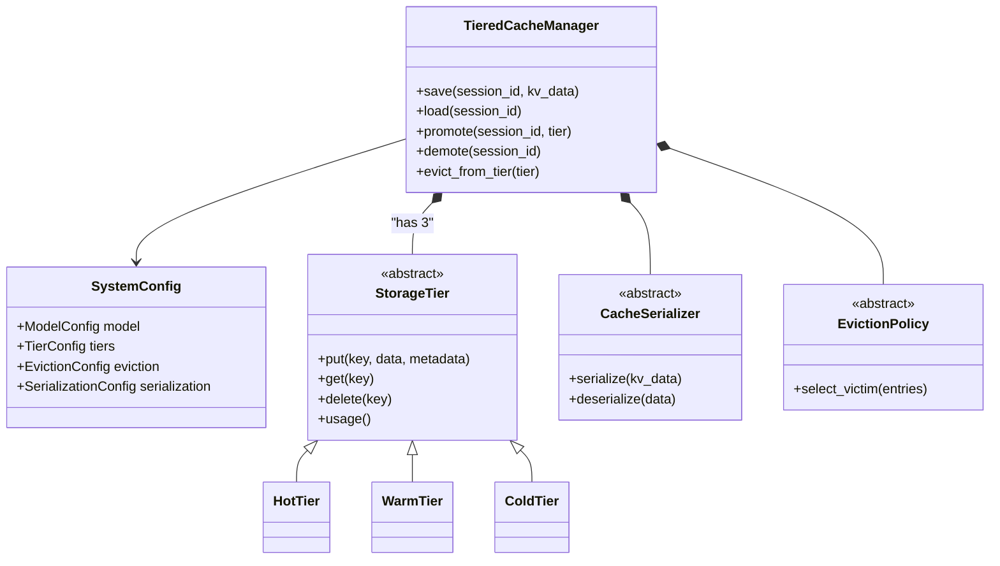
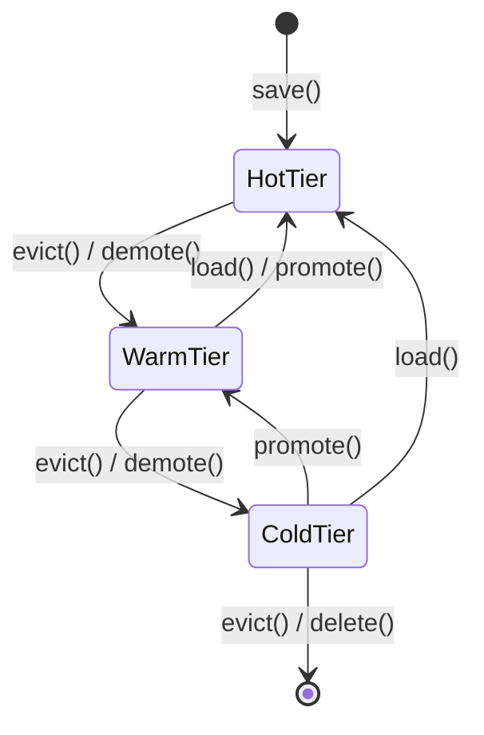

# System Architecture: KV Cache Tier Persistence

This document provides a deep dive into the technical architecture of the Tiered KV Cache Persistence system.

## 1. System Overview

The system acts as a middleware layer between an LLM inference engine (like vLLM) and physical storage media. It manages the lifecycle of Key-Value (KV) cache tensors associated with user sessions.



## 2. Tier Architecture and State Machine

A cache entry moves through the system based on access patterns and memory pressure.



### Hot Tier (GPU VRAM Simulator)
- **Implementation**: In-memory dictionary `Dict[str, bytes]`.
- **Performance**: Zero I/O overhead.
- **Constraints**: Strictly bounded capacity (e.g., 8GB).

### Warm Tier (NVMe SSD)
- **Implementation**: Local filesystem. Files stored as `{uuid}.cache`.
- **Performance**: High throughput sequential reads. Can leverage OS page cache.
- **Constraints**: Moderate capacity (e.g., 64GB - 1TB).

### Cold Tier (Object Storage)
- **Implementation**: `boto3` against S3/MinIO, or compressed local archive.
- **Performance**: Network bounded latency (~50-200ms).
- **Constraints**: Effectively infinite capacity.

## 3. Data Flow Operations

### The `save()` Flow
1. Inference engine completes sequence generation.
2. Interceptor passes `kv_data` dictionary to `TieredCacheManager.save()`.
3. Manager invokes `CacheSerializer.serialize()`.
4. If Hot Tier has insufficient capacity:
   - Call `EvictionPolicy.select_victim()`.
   - Call `demote(victim)` moving it to Warm Tier.
5. Store serialized bytes in Hot Tier.
6. Update `CacheIndex` metadata.

### The `load()` Flow
1. User resumes session.
2. Interceptor calls `TieredCacheManager.load(session_id)`.
3. Check `CacheIndex`. If missing -> Cache Miss.
4. Lookup tier location from metadata.
5. If in Hot Tier -> immediate return.
6. If in Warm/Cold Tier -> Read bytes -> Deserialize.
7. Call `promote()` to move entry to Hot Tier (triggering evictions if needed).
8. Return `kv_data` to inference engine.

## 4. Eviction Policy Framework

The `EvictionPolicy` abstraction isolates the decision logic from the storage mechanisms.

### Predictive Eviction Mathematics
The Predictive policy calculates a score for every entry $i$:

$$ Score_i = \alpha \cdot \left(\frac{freq_i}{freq_{max}}\right) + \beta \cdot e^{-\frac{t_{now} - t_{access}}{t_{half}}} + \gamma \cdot \left(\frac{tokens_i}{tokens_{max}}\right) $$

Where:
- $\alpha, \beta, \gamma$ are configurable weights (summing to 1.0)
- $t_{half}$ is the decay half-life (e.g., 30 minutes)
- The policy evicts the entry with the **lowest** score.

## 5. Performance Model

Based on hardware capabilities, expected transfer times for a 256MB KV Cache:

| Transfer Path | Method | Expected Latency | Bottleneck |
|---------------|--------|------------------|------------|
| Hot ↔ CPU | PCIe Gen4 x16 | ~10-20 ms | PCIe Bus (25GB/s) |
| CPU ↔ Warm | NVMe Sequential | ~30-50 ms | NVMe Write (7GB/s) |
| Warm ↔ Cold | 10Gbps Network | ~250-500 ms | Network Bandwidth |
| Serialize | safetensors | ~5 ms | CPU Memory Bandwidth |
| Compress | LZ4 | ~75 ms | CPU Compute (~3.5GB/s) |

*Note: In this standalone prototype, Hot ↔ CPU is simulated as memory ↔ memory.*

## 6. vLLM Integration Guide

To deploy this in a real vLLM environment:

1. Fork vLLM.
2. In `vllm/worker/cache_engine.py`, modify `swap_out()`:
   ```python
   def swap_out(self, src_to_dst: Dict[int, int]) -> None:
       # Extract tensors
       kv_data = self._extract_tensors(src_to_dst)
       # Send to our tiered manager instead of CPU ram
       self.tiered_manager.save(session_id, user_id, kv_data)
   ```
3. Use the `KVCacheInterceptor` (provided in this repo) as the bridge between vLLM's `BlockSpaceManager` and the `TieredCacheManager`.
