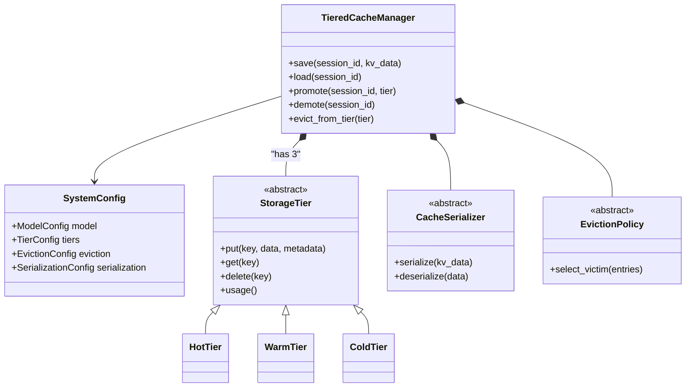
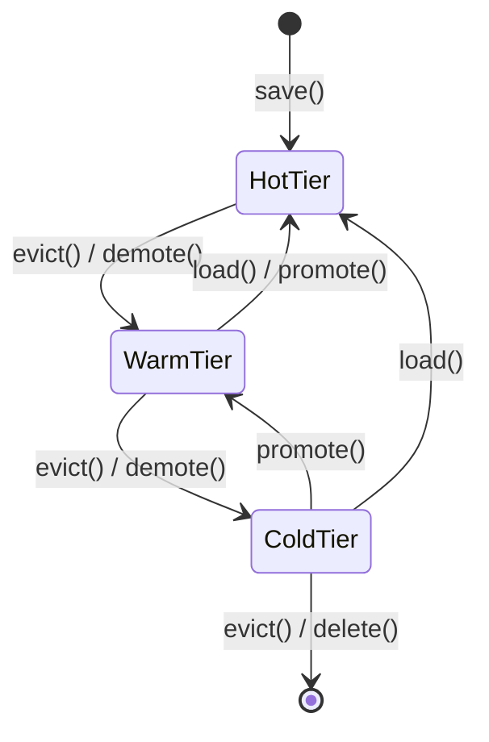

# System Architecture: KV Cache Tier Persistence

This document provides a deep dive into the technical architecture of the Tiered KV Cache Persistence system.

## 1. System Overview

The system acts as a middleware layer between an LLM inference engine (like vLLM) and physical storage media. It manages the lifecycle of Key-Value (KV) cache tensors associated with user sessions.


```mermaid
classDiagram
    class SystemConfig {
        +ModelConfig model
        +TierConfig tiers
        +EvictionConfig eviction
        +SerializationConfig serialization
    }
    
    class TieredCacheManager {
        +save(session_id, kv_data)
        +load(session_id)
        +promote(session_id, tier)
        +demote(session_id)
        +evict_from_tier(tier)
    }
    
    class StorageTier {
        <<abstract>>
        +put(key, data, metadata)
        +get(key)
        +delete(key)
        +usage()
    }
    
    class CacheSerializer {
        <<abstract>>
        +serialize(kv_data)
        +deserialize(data)
    }
    
    class EvictionPolicy {
        <<abstract>>
        +select_victim(entries)
    }
    
    TieredCacheManager --> SystemConfig
    TieredCacheManager *-- StorageTier : "has 3"
    TieredCacheManager *-- CacheSerializer
    TieredCacheManager *-- EvictionPolicy
    
    StorageTier <|-- HotTier
    StorageTier <|-- WarmTier
    StorageTier <|-- ColdTier
```

## 2. Tier Architecture and State Machine

A cache entry moves through the system based on access patterns and memory pressure.


```mermaid
stateDiagram-v2
    [*] --> HotTier : save()
    
    HotTier --> WarmTier : evict() / demote()
    WarmTier --> HotTier : load() / promote()
    
    WarmTier --> ColdTier : evict() / demote()
    ColdTier --> WarmTier : promote()
    ColdTier --> HotTier : load()
    
    ColdTier --> [*] : evict() / delete()
```

### Hot Tier (GPU VRAM Simulator)
- **Implementation**: In-memory dictionary `Dict[str, bytes]`.
- **Performance**: Zero I/O overhead.
- **Constraints**: Strictly bounded capacity (e.g., 8GB).

### Warm Tier (NVMe SSD)
- **Implementation**: Local filesystem. Files stored as `{uuid}.cache`.
- **Performance**: High throughput sequential reads. Can leverage OS page cache.
- **Constraints**: Moderate capacity (e.g., 64GB - 1TB).

### Cold Tier (Object Storage)
- **Implementation**: `boto3` against S3/MinIO, or compressed local archive.
- **Performance**: Network bounded latency (~50-200ms).
- **Constraints**: Effectively infinite capacity.

## 3. Data Flow Operations

### The `save()` Flow
1. Inference engine completes sequence generation.
2. Interceptor passes `kv_data` dictionary to `TieredCacheManager.save()`.
3. Manager invokes `CacheSerializer.serialize()`.
4. If Hot Tier has insufficient capacity:
   - Call `EvictionPolicy.select_victim()`.
   - Call `demote(victim)` moving it to Warm Tier.
5. Store serialized bytes in Hot Tier.
6. Update `CacheIndex` metadata.

### The `load()` Flow
1. User resumes session.
2. Interceptor calls `TieredCacheManager.load(session_id)`.
3. Check `CacheIndex`. If missing -> Cache Miss.
4. Lookup tier location from metadata.
5. If in Hot Tier -> immediate return.
6. If in Warm/Cold Tier -> Read bytes -> Deserialize.
7. Call `promote()` to move entry to Hot Tier (triggering evictions if needed).
8. Return `kv_data` to inference engine.

## 4. Eviction Policy Framework

`EvictionPolicy` (`src/kv_cache_tier/eviction/base.py`) isolates victim selection from the
storage mechanism. All policies read time through an injected `Clock`, so trace-driven
experiments run on simulated time rather than wall-clock time.

| Policy | Module | Victim rule | Reads cost model? |
|---|---|---|---|
| LRU | `lru.py` | Least recently accessed | No |
| TTL | `ttl.py` | Expired first, else LRU | No |
| Heuristic | `predictive.py` | Lowest `0.4f + 0.4r + 0.2v` | No |
| Logistic V1 | `predictive.py` | Lowest `P(resume)` | No |
| Value Density V2 | `value_density.py` | Lowest `P(resume)·cost(N)/bytes` | **Yes** |
| Space-Time V3 | `space_time.py` | Lowest `P(resume)·cost(N)/(bytes·E[Δt])` | **Yes** |
| Bélády / Oracle V1 / Oracle V3 | `oracle.py` | Ground truth from the replayed trace | V3 only |

The "reads cost model" column is load-bearing. Policies that consume the cost model change
*behavior* when it changes, so a re-pricing requires re-simulating them; the others can be
re-priced from logged hit histograms alone (see §7).

### Heuristic scoring

$$ Score_i = \alpha \cdot \frac{freq_i}{freq_{max}} + \beta \cdot e^{-\frac{t_{now} - t_{access}}{t_{half}}} + \gamma \cdot \frac{tokens_i}{tokens_{max}} $$

with $\alpha=0.4$, $\beta=0.4$, $\gamma=0.2$ and $t_{half}=30$ min. Lowest score is evicted.

### Oracle policies

`oracle.py` provides clairvoyant baselines for ablation. They index the replayed event list
to answer "when is this session next accessed?", which is legitimate only because replay is
open-loop: arrivals never depend on cache behavior. They are excluded from the default
matrix and must be named explicitly via `--policies`.

## 5. Cost Model

`src/kv_cache_tier/utils/cost_model.py` prices what a hit is worth, parameterized by a
`ModelSpec` and `GPUSpec` from `src/kv_cache_tier/utils/hardware.py`. Both the simulator and
`benchmarks/breakeven_analysis.py` import from that one module so the two cannot diverge.

$$ t_{prefill}(N) = \frac{2PN + 4 L H_q d N^2}{F \cdot \eta} \qquad t_{restore}(N) = \ell_{tier} + \frac{2 L H_{kv} d b N}{B_{tier}} $$

A hit is credited `max(t_prefill - t_restore, 0)`. The floor matters: whether a hit is worth
anything at all depends on the served architecture, through the break-even length $N^*$.

| Model | KV/token | $N^*$ (NVMe) | $N^*$ (S3) |
|---|---|---|---|
| TinyLlama-1.1B (GQA 4/32) | 22 KB | 1,561 | 25,901 |
| Llama-2-7B (MHA 32/32) | 512 KB | 43,559 | 254,203 |
| Llama-2-70B (GQA 8/64) | 320 KB | 12 | 289 |

**This module previously had no architecture in it.** It priced prefill with two hardcoded
constants whose linear/quadratic crossover sat near 1,300 tokens, where real transformers
cross between 12k and 53k. That inflated a long session's worth relative to a short one by
3–4.5x and inverted the study's headline conclusion. It is now covered by
`tests/test_cost_model.py`, including a check that predictions land within 2x of measured
GPU prefill latency, and that its $N^*$ values match the break-even analysis exactly.

### Scale model

The simulator serializes a downscaled geometry (2 layers, 2 heads, head_dim 32, FP16 =
512 bytes/token) so traces fit in memory, while pricing value and restore at the target
architecture. The two views are reconciled by holding the session-count-to-capacity ratio
fixed: a 500 MB simulated cache stands in for a `500 MB x (kv_bytes_per_token / 512)` cache
at the target architecture. Capacity dynamics are simulated; economics are real.

## 6. Storage Performance Model

Modeled tier characteristics (`hardware.py`), used for both restore cost and the break-even
analysis:

| Tier | Latency | Bandwidth |
|---|---|---|
| Hot (VRAM-resident) | 0.1 ms | pointer swap |
| Warm (NVMe) | 10 ms | 2 GB/s |
| Cold (object storage) | 100 ms | 500 MB/s |

**Compression is not used.** Measured on real serialized TinyLlama KV tensors
(`benchmarks/compression_benchmark.py`), the best general-purpose codec achieves 1.10x
(Zstd; LZ4 1.01x), and every codec makes cold-tier restore *slower* than sending raw bytes.
FP16 mantissas are close to incompressible for byte-oriented codecs. Format-aware KV codecs
are the alternative; see the paper's related work.

## 7. Reproduction Tooling

| Script | Purpose |
|---|---|
| `benchmarks/experiment_runner.py` | The matrix. Flags: `--arch`, `--capacity-mb`, `--persona-sigma`, `--predictor`, `--policies`, `--workloads`, `--azure` |
| `benchmarks/rescore_results.py` | Re-price finished runs at another architecture from logged hit histograms. Refuses cost-model-bound policies |
| `benchmarks/make_paper_tables.py` | Raw shards to console tables plus LaTeX bodies |
| `benchmarks/breakeven_analysis.py` | $N^*$ per architecture and tier, plus Figure 4 |
| `benchmarks/compression_benchmark.py` | LZ4/Zstd/zlib on real KV bytes |
| `benchmarks/generate_figures.py`, `generate_capacity_figure.py` | Paper figures from committed aggregates |
| `benchmarks/context_sweep_gpu.ipynb` | Long-context TTFT sweep (Colab) |

Each run logs a `hit_histogram` over `(cached_tokens, tier)`, which is a sufficient statistic
for re-pricing without re-simulating. `make` targets: `reproduce`, `reproduce-arch`,
`reproduce-azure`, `reproduce-oracle`, `reproduce-capacity`, `reproduce-persona`,
`bench-compression`, `arxiv`.

## 8. vLLM Integration Guide

To deploy this in a real vLLM environment:

1. Fork vLLM.
2. In `vllm/worker/cache_engine.py`, modify `swap_out()`:
   ```python
   def swap_out(self, src_to_dst: Dict[int, int]) -> None:
       # Extract tensors
       kv_data = self._extract_tensors(src_to_dst)
       # Send to our tiered manager instead of CPU ram
       self.tiered_manager.save(session_id, user_id, kv_data)
   ```
3. Use the `KVCacheInterceptor` (provided in this repo) as the bridge between vLLM's `BlockSpaceManager` and the `TieredCacheManager`.
