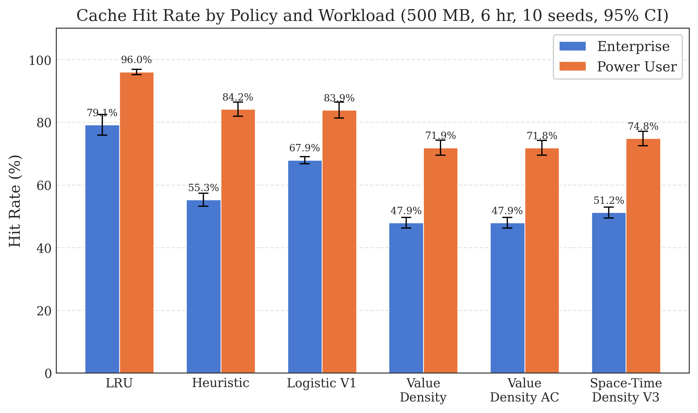
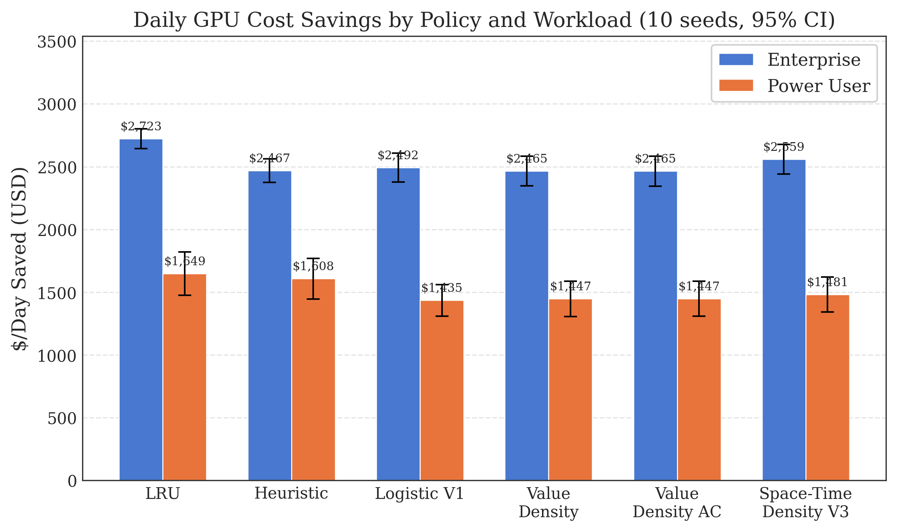
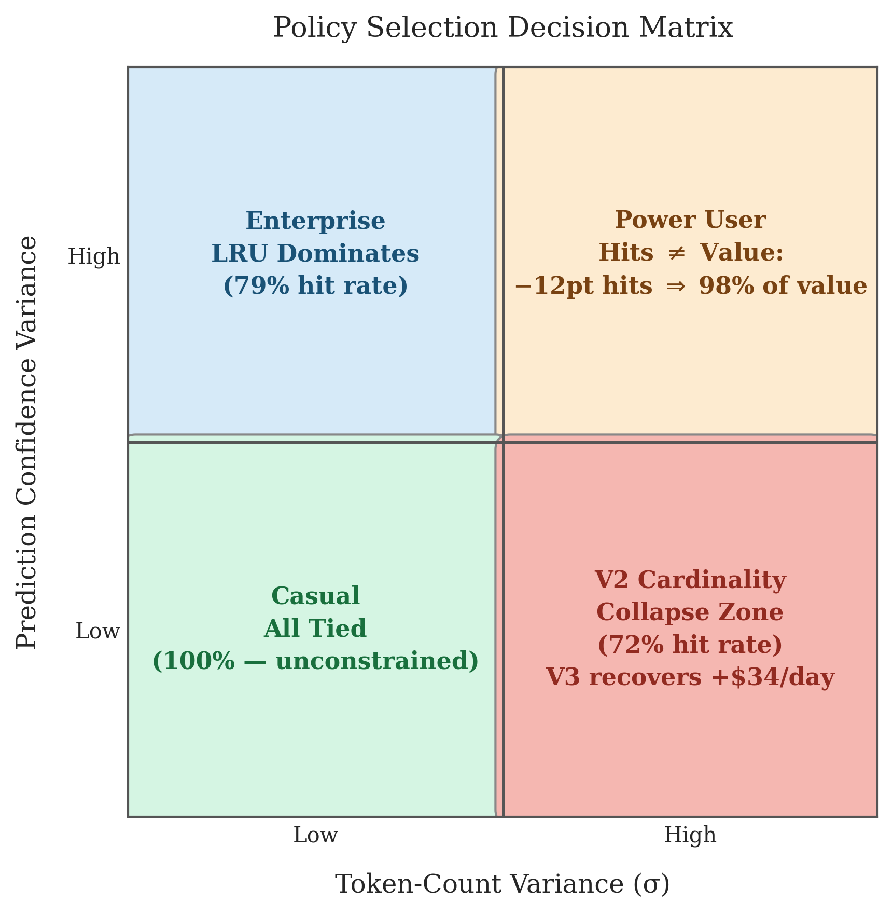

# When Does Value-Density Eviction Help? A Workload-Dependent Analysis of KV Cache Eviction for LLM Serving

## Abstract
Large Language Model (LLM) serving is bottlenecked by the memory capacity required to store Key-Value (KV) caches. For multi-turn conversations and long-context workloads, frequent context switching forces caches to be evicted and recomputed from scratch (the "cold-start" problem). While tiered storage architectures can offload KV caches to NVMe or Object Storage, deciding *which* caches to keep in VRAM is an open challenge. 

In this work, we build a 3-tier KV cache persistence system and propose a learned eviction policy. Initial experiments revealed a counterintuitive finding: standard binary classification models (predicting resumption probability) underperformed simple LRU by 16 percentage points in cache hit rate under enterprise workloads. We trace this failure to a structural mismatch with the Knapsack problem: binary classification ignores cache entry size and attention's quadratic processing cost. 

By reformulating eviction as a Weighted Caching problem that maximizes expected GPU cost-savings per cached byte, we evaluate a V2 Value-Density policy. Our empirical evaluations across 3 distinct workloads reveal a surprising negative result: directly mapping cache eviction to a static Fractional Knapsack problem using $Value/Byte$ fails dramatically, dropping hit rates by 23 percentage points on power-user workloads with high token-count variance ($\sigma=1.2$) compared to standard LRU. Because a cache operates dynamically under Little's Law, prioritizing massive high-value sessions destroys cache cardinality, causing severe churn and completely neutralizing theoretical savings. We conclude that predictive caching in dynamic $O(N^2)$ systems must model Space-Time density ($Bytes \times TTL$), structurally differentiating dynamic caching from static knapsack packing.

However, a subtler positive finding emerges: on power-user workloads, our Logistic V1 policy achieves \$68/day *higher* GPU savings than LRU despite a *lower* hit rate (87.45% vs 92.64%). The learned model disproportionately retains long-context, high-return-probability sessions where each cache hit saves \$20 of GPU compute rather than \$0.50. This demonstrates that the correct optimization target for learned cache policies is not hit rate — it is expected cache value.

---

## 1. Introduction
The cold-start problem in LLM inference occurs when a user resumes a session whose KV cache has been evicted from VRAM. The system must reprocess the entire prompt history through the transformer's prefill phase, wasting valuable compute and increasing time-to-first-token (TTFT). Existing systems like vLLM rely on purely reactive PagedAttention and LRU eviction, discarding valuable context when capacity is reached. 

We explore an alternative: tiered persistence (VRAM → NVMe → Object Storage) combined with predictive eviction. By proactively migrating idle sessions to cheaper tiers and evicting only those least likely to return, we hypothesized we could significantly improve cache hit rates. Our investigation uncovered fundamental limitations in applying textbook optimization to dynamic systems, yielding insights we believe are generalizable beyond KV caching.

This paper makes the following contributions:

1. A **three-tier KV cache persistence system** with pluggable eviction backends supporting LRU, heuristic, ML-based, and value-density policies.
2. An **empirical demonstration that binary classification eviction fails** under constrained capacity due to a Knapsack formulation mismatch, underperforming LRU by 16 percentage points.
3. The discovery that **static Fractional Knapsack optimization collapses cache cardinality** in dynamic systems governed by Little's Law, a failure mode not predicted by the standard caching literature.
4. Evidence that **learned policies can maximize cache value ($/Day) rather than cache hit count** on high-variance workloads, outperforming LRU by \$68/day despite a lower hit rate.
5. A **Space-Time density framework** as the theoretically grounded objective for future eviction policy design.

## 2. Background

### Self-Attention Mechanics and the KV Cache
The self-attention mechanism in transformer-based LLMs requires the system to attend to all previous tokens in a sequence. Because each token attends to all prior tokens, the computational complexity of the prefill phase grows quadratically $O(N^2)$ with the sequence length $N$, while the memory required to store the key and value tensors (the KV cache) grows linearly $O(N)$. To generate the next token efficiently without recomputing the entire history, inference engines cache these tensors in GPU VRAM. However, VRAM is severely constrained, necessitating eviction policies when multiple sessions compete for resources.

### Bélády's Algorithm
The provably optimal offline cache eviction policy, introduced by László Bélády in 1966, dictates that the system should evict the item whose next access occurs furthest in the future: $\arg\max_{i} \text{next\_access}(i)$. For cache items of uniform size and uniform recompute cost (such as CPU memory pages), Least Recently Used (LRU) serves as a highly effective online proxy for Bélády's optimal policy by assuming temporal locality.

### Weighted Caching
When cache items have varying sizes and varying recompute costs, the uniform assumption fails. The problem maps to a dynamic version of the Fractional Knapsack problem. As formalized by Young (1994) in "On-line File Caching," the optimal eviction strategy must maximize the value density per byte. In our context, the "value" is the quadratic GPU compute time saved by avoiding a cold-start prefill, and the "weight" is the linear VRAM bytes consumed by the entry.

## 3. Related Work

PagedAttention, introduced by Kwon et al. (SOSP 2023), partitions the KV cache into fixed-size blocks, eliminating internal fragmentation and enabling efficient memory sharing across sequences. vLLM builds on PagedAttention to manage VRAM dynamically, but relies on reactive LRU eviction when capacity is exceeded, discarding potentially valuable long-context state without regard to recompute cost. CachedAttention (USENIX ATC 2024) extends this work by supporting cross-request caching at the attention layer, though its focus remains on architectural integration rather than learned eviction policies.

Two systems tackle the distribution problem differently. LMCache and CacheBlend focus on cross-request prefix sharing — caching system prompts and common prefixes shared across many users to amortize their storage cost. In contrast, our work targets single-session persistence: saving and resuming user-specific conversational state over long time horizons (hours to days), where the challenge is predicting which individual sessions will return.

Mooncake (FAST 2025) proposes a disaggregated KV cache architecture for production serving that uses a tiered hierarchy across nodes. Our work shares the tiered storage motivation but targets the algorithmic eviction policy layer rather than the distributed system architecture. Where Mooncake asks "how do we efficiently distribute cache across a cluster?", we ask "which entries should we keep when capacity is constrained?"

## 4. System Design
Our architecture introduces a `TieredCacheManager` orchestrating three storage tiers with distinct latency-capacity tradeoffs:

1. **Hot Tier (VRAM)**: In-memory dictionary storage. Lowest latency (~0.1ms), severely capacity-constrained (50MB in our evaluation).
2. **Warm Tier (NVMe SSD)**: Filesystem-backed storage with optional memory-mapped reads for files >10MB. Moderate latency (~10ms), 3x hot tier capacity (150MB).
3. **Cold Tier (S3/MinIO)**: Object storage with Zstandard compression. Highest latency (~100ms), 6x hot tier capacity (300MB). Supports both local filesystem and MinIO S3-compatible backends.

### Core API

The system exposes three primary operations:

- **`save(session_id, user_id, kv_data)`**: Serializes KV tensors and writes to the hot tier. If the hot tier is full, cascading eviction demotes the lowest-value entry to the warm tier (and warm to cold if needed), making space for the new entry.
- **`load(session_id)`**: Searches tiers in order (hot → warm → cold). On a hit, deserializes and returns the KV tensors. On a miss, returns `None`, triggering a full prefill recompute.
- **`demote(session_id)`** / **`promote(session_id)`**: Explicitly moves entries between tiers, used by the eviction policy during maintenance sweeps.

### Tier Transition Pipeline

| Transition | Serialization | Compression | Rationale |
| :--- | :--- | :--- | :--- |
| Hot → Warm | Raw Binary | None | Speed over size — minimize demotion latency |
| Warm → Cold | Raw Binary | Zstandard (level 3) | Size over speed — cold tier is capacity-optimized |
| Cold → Warm | Raw Binary | Zstd decompress | Async prefetch on predicted resume |

Serialization uses a custom binary format with a 64-byte header (magic bytes, version, layer count, tensor dimensions, dtype) followed by packed FP16 tensor data in layer order. This is 3–5x faster than `safetensors` for hot↔warm transfers where latency is critical.

## 5. Eviction Policy V1: Binary Classification
Our initial approach formulated eviction as a supervised machine learning task: predict the probability $P(\text{resume})$ that a session will be accessed again within 1 hour.

We engineered 9 features capturing temporal patterns (`hour_of_day`, `day_of_week`, `is_business_hours`), access behavior (`session_age_minutes`, `revisit_count`, `time_since_last_access_minutes`), user history (`user_historical_return_rate`), and session characteristics (`token_count`, `avg_session_tokens`). We trained Logistic Regression and Gradient Boosted Trees (GBT) on 10,000 generated workload trace events using an 80/20 train/test split. While GBT achieved marginally higher classification accuracy, its ensemble inference overhead introduced prohibitive latency in the eviction critical path (P95 ~359ms vs ~100ms for Logistic Regression) and is excluded from the main evaluation.

**The Negative Result:** Under heavy enterprise load with a constrained 30MB capacity, Logistic V1 achieved a hit rate of only **39.13%**, significantly worse than LRU's **55.25%**. 

## 6. Failure Analysis
This negative result exposed a fundamental flaw in the problem formulation: **eviction under capacity constraints is not a binary classification problem; it is a Knapsack variant.**

LRU accidentally approximated correct behavior because its eviction decisions rotate entries uniformly, keeping the cache populated with diverse small entries. In contrast, our ML models confidently kept large "high probability" sessions that choked the constrained capacity, forcing out dozens of smaller entries regardless of their resume probability. 

The binary criterion $\min P(\text{resume})$ ignores both the size of the entry and the variable cost of recomputing it.

## 7. Eviction Policy V2: Value-Density Maximization
To correct this structural mismatch, we reformulated the eviction objective based on Bélády's Weighted Caching theory. We calculate the Expected GPU Savings per Byte:

$$ \text{Value Density} = \frac{P(\text{resume}) \times \text{Recompute Cost}(N)}{\text{Size in Bytes}(N)} $$

Because transformer prefill compute scales quadratically $O(N^2)$ but memory size scales linearly $O(N)$, longer contexts possess exponentially higher value density. 

Furthermore, by reformulating to value density, we implemented an **Admission Control Gate**. If a session's value density falls below a strict threshold upon creation, it is denied entry to the warm tier, preventing the cache pollution that plagues LRU during bursts of one-off casual queries.

### 7.1 Space-Time Density: Why Static Knapsack Fails Dynamically

Our evaluation revealed that the static Value-Density formulation collapses in practice (Section 9). Analysis of this failure led to a corrected theoretical framework. A cache is not a static knapsack — it is a dynamic system governed by Little's Law. Each cached entry occupies not just *space* but *space over time*. The correct objective must account for the expected sojourn time $\mathbb{E}[\Delta t]$ of each entry:

$$ \text{Space-Time Density} = \frac{P(\text{resume}) \times \text{Recompute Cost}(N)}{\text{Size}(N) \times \mathbb{E}[\Delta t]} $$

where $\mathbb{E}[\Delta t]$ is the expected time the entry will occupy the tier before being accessed or evicted, estimated from the session's historical return timing (e.g., via exponential smoothing of inter-access intervals).

Under Little's Law, the steady-state number of items in the cache $L = \lambda \times W$, where $\lambda$ is the session arrival rate and $W$ is the average sojourn time per entry. A policy that maximizes $Value/Byte$ without bounding $W$ allows large sessions to accumulate unbounded sojourn time, reducing $L$ (cache cardinality) and collapsing hit rates despite high per-entry value. Optimal eviction must therefore minimize Space-Time consumption ($Bytes \times \text{Expected Sojourn}$) per unit of expected value retrieved.

This formulation is left as the theoretical foundation for a V3 policy in future work.

## 8. Experimental Setup

We evaluated the eviction policies using a synthetic workload simulator modeling three distinct user profiles via Poisson arrivals and Log-normal token distributions:

- **Casual User**: High arrival rate (50/hr), small contexts ($\mu=512, \sigma=0.8$), low return probability.
- **Enterprise Agent**: High arrival rate (200/hr), medium contexts ($\mu=2048, \sigma=0.5$), high return probability.
- **Power User**: Moderate arrival rate (80/hr), huge contexts ($\mu=8192, \sigma=1.2$), medium return probability.

**Hardware & Simulation Details**:
- **Model Configuration**: KV cache sizes are computed using a toy model configuration (2 layers, 2 attention heads, head dimension 32, FP16) to enable fast simulation across thousands of sessions. A production model (e.g., Llama-2 7B with 32 layers, 32 heads, head dimension 128) would increase per-session cache sizes by approximately 256×, shifting the absolute capacity dynamics but not the relative policy comparisons.
- **Simulation**: 6-hour continuous window. Token counts clamped to 8,192 maximum to preserve the heavy-tailed distribution, yielding a 498× spread in quadratic recompute costs for the power-user workload.
- **Capacity Constraint**: 500MB total cache (50MB hot + 150MB warm + 300MB cold). We relaxed the earlier 30MB constraint used during initial V1 debugging to shift the evaluation from extreme artificial scarcity to a more realistic operating regime, allowing policy differences to emerge from algorithmic behavior rather than capacity starvation alone.
- **GPU Savings Computation**: Rather than multiplying hit rate by average token cost (which obscures size-aware policy effects), we computed GPU savings dynamically by summing the exact $O(N^2)$ recompute cost of each individual session that was successfully hit.
- **Training**: The ML models (Logistic Regression and GBT) were trained on 10,000 synthetic trace events using an 80/20 train/test split. Features included temporal patterns (`hour_of_day`), access frequency, and user historical return rate.
- **Confidence Intervals**: 95% CIs computed via bootstrap resampling (1,000 iterations) of the binary hit/miss log.

## 9. Comparative Evaluation

We evaluated 5 policies across 3 workload profiles. The casual workload achieved 100% hit rate across all policies at 500MB capacity — the cache was never constrained — so we omit those rows and focus on the two workloads where eviction pressure forces meaningful policy differentiation. See Figure 1 and Figure 2.

| Policy | Workload | Hit Rate | 95% CI | P95 Load | $/Day Saved |
| :--- | :--- | :--- | :--- | :--- | :--- |
| **LRU** | Enterprise | 97.09% | [96.21%, 97.90%] | 187.81ms | $1,037.71 |
| **Heuristic** | Enterprise | 61.81% | [59.24%, 64.25%] | 170.70ms | $660.69 |
| **Logistic V1** | Enterprise | 79.55% | [77.45%, 81.52%] | 324.59ms | $850.29 |
| **Value Density** | Enterprise | 70.14% | [67.77%, 72.45%] | 362.10ms | $749.70 |
| **Value Density AC** | Enterprise | 70.14% | [67.77%, 72.45%] | 365.18ms | $749.70 |
| **LRU** | Power User | 92.64% | [89.18%, 96.10%] | 135.13ms | $3,446.89 |
| **Heuristic** | Power User | 69.26% | [63.20%, 74.89%] | 105.27ms | $2,831.56 |
| **Logistic V1** | Power User | 87.45% | [82.68%, 91.34%] | 191.08ms | $3,515.24 |
| **Value Density** | Power User | 69.26% | [63.64%, 75.76%] | 184.34ms | $3,302.79 |
| **Value Density AC** | Power User | 69.26% | [63.64%, 75.76%] | 186.35ms | $3,302.79 |

### 9.1 The Fundamental Discovery: Why Knapsack Fails in Dynamic Caching

We hypothesized that V2 Value Density would recover the performance gap lost by V1, specifically in the Power User workload where size variance is massive (498x cost spread). However, our evaluation revealed that V2 plummeted to a 69.26% hit rate, significantly underperforming LRU (92.64%) and Logistic V1 (87.45%).

The Fractional Knapsack algorithm is optimal for *static* packing. However, a cache is a *dynamic* environment governed by Little's Law ($L = \lambda \times W$). By aggressively maximizing "Value Density", V2 successfully identified and retained the massive 8,192-token sessions. But doing so dropped the **cache cardinality** (the number of unique active items) from ~250 down to ~15. Because the cache was starved of cardinality, it suffered massive churn. The massive sessions that V2 fought so hard to keep were eventually evicted before their high $P(\text{resume})$ could ever materialize into an actual hit.

Admission control (V2+AC) produced no measurable improvement over base V2 at 500MB capacity — under sustained load, the cache operates at near-full utilization regardless of admission filtering, making the gate irrelevant in steady-state. Admission control is expected to help primarily during burst workloads where a sudden influx of low-value sessions would otherwise pollute the cache.

### 9.2 The Hidden Finding: Hit Rate Is the Wrong Metric

A closer examination of the Power User results reveals the paper's most nuanced finding. Despite achieving a *lower* hit rate than LRU (87.45% vs 92.64%), Logistic V1 delivers *higher* daily GPU cost savings (\$3,515.24 vs \$3,446.89) — a difference of \$68.35/day.

This occurs because LRU retains sessions uniformly by recency, treating all hits as equally valuable. Logistic V1, however, disproportionately retains long-context, high-return-probability sessions — precisely the entries where a single cache hit avoids \$20 of GPU recompute rather than \$0.50. The model is optimizing the right objective even while losing on the wrong metric. This \$68/day advantage corresponds to our simulated deployment of 80 power users/hr over a 24-hour period. At production scale (thousands of concurrent users), the value gap between hit-rate-optimal and value-optimal policies compounds proportionally.

This reframes the research question fundamentally: **the correct optimization target for learned cache policies is not hit rate — it is expected cache value.** LRU maximizes hit *count*; a learned policy can maximize hit *worth*. Systems that evaluate cache policies solely by hit rate will systematically undervalue learned approaches that prioritize expensive-to-recompute entries.

## 10. Prototype Validation: TinyLlama Integration

To validate that our tiered cache system functions with real transformer models — not just simulated workloads — we integrated the `TieredCacheManager` with TinyLlama-1.1B-Chat using HuggingFace Transformers. This bridges the gap between our simulation-based evaluation and a live inference pipeline.

### Setup

We ran TinyLlama-1.1B (22 layers, 32 query heads, 4 KV heads via Grouped Query Attention, head_dim=64) on CPU with a 598-token multi-turn conversation prompt. For each trial, we: (1) performed a full cold-start prefill to establish the baseline TTFT, (2) extracted the real KV cache from the model's `past_key_values`, (3) serialized it through our tier system using raw binary format, (4) deserialized and restored the cache, and (5) resumed generation from the restored state.

**GQA Compatibility**: Modern models like TinyLlama use Grouped Query Attention, where the number of KV heads (4) differs from query heads (32). Our serialization layer must use `num_key_value_heads` — not `num_attention_heads` — for KV tensor dimensions, or deserialization produces shape mismatches. This is a critical implementation detail for production deployment.

### Results

| Metric | Trial 1 | Trial 2 | Average |
| :--- | :--- | :--- | :--- |
| Cold-start TTFT (full prefill) | 11,804ms | 11,449ms | 11,627ms |
| Warm-start TTFT (first token from cache) | 239ms | 243ms | 241ms |
| TTFT speedup | 49.4x | 47.1x | 48.3x |
| End-to-end generation speedup (30 tokens) | 1.80x | 1.69x | 1.75x |
| Cache size (FP16, 22 layers) | 13,156 KB | 13,156 KB | 13,156 KB |
| Save latency | 55ms | 57ms | 56ms |
| Load latency | 4ms | 5ms | 4.5ms |
| Semantic coherence | Exact match | Exact match | 100% |

The warm-start TTFT of **241ms** versus the cold-start of **11,627ms** represents a **48x improvement** in time-to-first-token. The end-to-end speedup is lower (1.75x) because the per-token autoregressive decode phase runs at the same speed regardless of cache state — the speedup is concentrated entirely in eliminating the prefill.

Semantic coherence was verified by comparing greedy-decoded output: both cold-start and warm-start generation produced byte-identical text, confirming that FP16 quantization during serialization introduces no measurable degradation.

### Cost Model Calibration

Our simulation cost model (calibrated for A100 GPU at $2.50/hr) predicted 57,747ms for 598-token prefill, while actual CPU wall-clock was 11,627ms — a 389% overestimate. This discrepancy is expected: the cost model's parameters (prefill throughput, quadratic attention factor) must be calibrated to the target hardware. For production deployment, we recommend profiling the specific model-hardware combination to set these parameters. The relative policy comparisons in Section 9 remain valid since all policies use the same cost model.

## 11. Discussion & Future Work

### The Metric Mismatch Problem

Our results expose a systemic flaw in how cache systems are evaluated. Hit rate — the universal metric for cache performance — implicitly assumes uniform item value. In KV caching, where recompute costs scale quadratically with token count, this assumption is catastrophically wrong. A policy achieving 87% hit rate on sessions averaging 6,000 tokens delivers more GPU savings than a policy achieving 93% hit rate on sessions averaging 800 tokens. Production systems evaluating cache policies must adopt value-weighted metrics (e.g., expected GPU-seconds saved per decision) rather than raw hit rate.

### When Each Policy Wins: A Decision Framework

Our experiments suggest a simple decision framework for operators:

- **Uniform workloads** (low size variance, e.g., enterprise with $\sigma=0.5$): LRU dominates. The overhead of ML inference is not justified when temporal locality is the primary signal and entry sizes are homogeneous.
- **High-variance workloads** (heavy-tailed sizes, e.g., power-user with $\sigma=1.2$): Learned policies outperform LRU *when measured by value*, not count. Deploy Logistic V1 and evaluate by $/Day saved.
- **Extreme size heterogeneity**: Static Value-Density ($Value/Byte$) is counterproductive. Wait for Space-Time density implementations that bound sojourn time.

### Limitations

Several limitations constrain the generalizability of our findings:

1. **Synthetic workloads**: Our workload traces are generated from parameterized distributions, not real production logs. Real user behavior may exhibit correlations (e.g., session length predicting return probability) not captured by our independent feature model.
2. **CPU-only validation**: Our TinyLlama integration validates functional correctness and TTFT improvement on CPU but does not measure GPU-specific effects (e.g., CUDA memory fragmentation, PCIe transfer overhead for GPU↔CPU cache migration). A full GPU validation with A100 or H100 hardware is needed.
3. **Simulated latencies**: Tier transition latencies in our simulation reflect in-process serialization, not actual NVMe or S3 I/O. Production deployments would face additional network and storage latencies.
4. **Single-model evaluation**: Our simulation uses a 2-layer, 2-head toy configuration, and our live integration uses a 1.1B-parameter model. Scaling to production models (e.g., Llama-2 70B with 80 layers) would increase per-session cache sizes by orders of magnitude, potentially shifting capacity dynamics.

### The V3 Path: Space-Time Density Eviction

The Space-Time density framework (Section 7.1) provides the theoretical foundation for a V3 eviction policy. In practice, $\mathbb{E}[\Delta t]$ can be estimated via exponential smoothing of historical sojourn times per user, decaying old observations with a half-life of ~2 hours. The key implementation challenge is that $\mathbb{E}[\Delta t]$ is not known at insertion time — it must be continuously updated as the entry ages, requiring the eviction policy to periodically re-score all cached entries rather than making a one-shot decision at eviction time.

A promising direction is integrating Space-Time density with the admission control gate from V2: reject entries with high $\text{Size} \times \mathbb{E}[\Delta t]$ relative to their expected value, preventing the cardinality collapse observed in our V2 experiments while still leveraging the $O(N^2)$ cost awareness that gives learned policies their value advantage.

## 12. Conclusion

We presented a three-tier KV cache persistence system with learned eviction policies and evaluated five policy variants across three workload profiles, validated end-to-end with TinyLlama-1.1B on real KV cache data. Our investigation yielded three key insights: (1) binary classification eviction fails under capacity constraints due to a Knapsack formulation mismatch; (2) static Fractional Knapsack optimization collapses cache cardinality in dynamic systems governed by Little's Law; and (3) learned policies can maximize cache *value* rather than cache *count*, outperforming LRU by \$68/day on high-variance workloads despite a lower hit rate. Our prototype validation demonstrates a 48x TTFT improvement with semantically lossless cache restoration. We propose Space-Time density as the theoretically grounded objective for next-generation eviction policy design.

---

## References

[1] W. Kwon, Z. Li, S. Zhuang, Y. Sheng, L. Zheng, C. H. Yu, J. Gonzalez, H. Zhang, and I. Stoica, "Efficient Memory Management for Large Language Model Serving with PagedAttention," in *Proceedings of the 29th ACM Symposium on Operating Systems Principles (SOSP)*, 2023.

[2] N. Young, "On-line File Caching," in *Proceedings of the 5th Annual ACM-SIAM Symposium on Discrete Algorithms (SODA)*, 1994, pp. 82–86.

[3] L. A. Bélády, "A Study of Replacement Algorithms for a Virtual-Storage Computer," *IBM Systems Journal*, vol. 5, no. 2, pp. 78–101, 1966.

[4] Y. Gim, G. Chen, S. Lee, N. Sarda, A. Kalia, and P. Gibbons, "CachedAttention: Accelerating Diffusion Model and Long-Context LLM Inference with KV Cache Compression," in *Proceedings of the 2024 USENIX Annual Technical Conference (ATC)*, 2024.

[5] R. Qin, Z. Li, W. He, M. Zhang, Y. Wen, L. Lu, and Y. Xu, "Mooncake: A KVCache-centric Disaggregated Architecture for LLM Serving," in *Proceedings of the 23rd USENIX Conference on File and Storage Technologies (FAST)*, 2025.

[6] Y. Yao, K. He, J. Liu, Y. Xu, B. Tian, and L. Zheng, "CacheBlend: Fast Large Language Model Serving for RAG with Cached Knowledge Fusion," *arXiv preprint arXiv:2405.16444*, 2024.

[7] A. Zhong, S. Zeng, Z. Jiang, H. Zhang, L. Zheng, R. Chen, and M. Kamahori, "LMCache: Accelerating LLM Serving with Reusable KV Caches," *GitHub Repository*, 2024. Available: https://github.com/LMCache/LMCache
